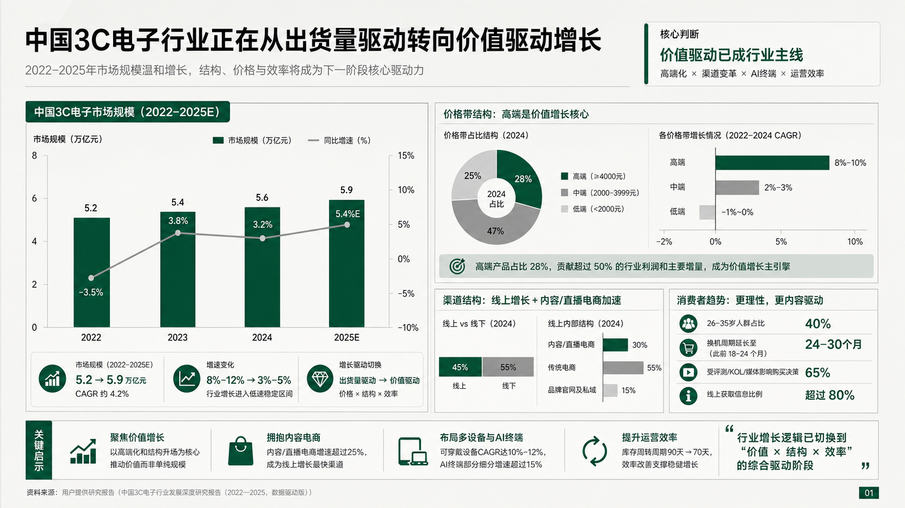
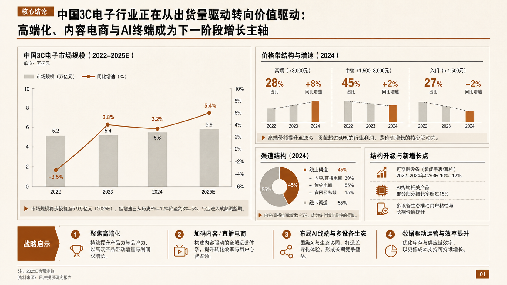

# CyberPPT

[简体中文](README.md) | [繁體中文](README.zh-TW.md) | [English](README.en.md) | [日本語](README.ja.md) | [한국어](README.ko.md) | [Français](README.fr.md) | [Português](README.pt.md) | [Español](README.es.md) | [العربية](README.ar.md)

CyberPPT 是一个 Codex Skill，用于把文档、研究材料和业务数据转化为高密度、可编辑、咨询风格的 PowerPoint 演示文稿。

适用场景：咨询风格 PPT，高信息密度，包括行业研究、消费品分析、品牌战略、电商分析、用户研究、高管汇报、董事会材料、客户提案和项目复盘。 

不适用场景：字少的低信息密度风格，包括演讲、个人风格表达、叙事、分享、观点类 PPT。

CyberPPT 的核心不是“套模板”，而是把源材料先转成可审计证据链，再通过 SCR 论证、页面密度规划、视觉蓝图和严格门禁，生成可编辑且高保真的咨询式 PPTX。

## **使用方法（必看！）**

分为三个阶段：

**1.资料分析。**

-安装Skill，明确告诉Codex：“使用XX文件夹下的CyberPPT这个skill，根据上传的文档/资料做一份PPT。”以及其他补充的要求。这个阶段会分析你的资料，出证据底稿。

-备注：这里它会自动分析、确认做多少页，如果你要指定，也可以指定。

**2.选择风格和制作蓝图。**

-这里会有8种内置的风格供你选择，选完以后，进入生成蓝图流程，会一次性把所有页面的蓝图做出来，这里还不可以编辑。

**3.生成可编辑的PPT。**

-这一阶段会把蓝图挨个还原，特别要注意，AI的注意力会分散，如果你发现它在一次性把全部还原，立即停下，告诉它：“严格按照Skill逐页还原。”否则它会偷懒，只出骨架图。如果还原结果有偏差

**最后说明**

-必须经过三个阶段不可跳过，才能保证该Skill能还原蓝图的90%左右，最难还原的是曲线图表，如果你发现跑偏了，可以截图让Codex精细还原。小图标AI容易给错，可以指出问题让AI重新给。剩下的换行、字体大小的问题，可以自己编辑调整，不要试图追求100%完美还原，能做到，但是有随机性（即抽卡），有时候能一次性搞定，有的时候会有一些跑偏。如果一定要让AI达到100%，花费的调试过程、Token会比较多，但建议还是：AI搞定90%，剩下10%自己搞定，否则直接用蓝图就可以了。

## 核心能力

- 从 DOCX、PDF、TXT、XLSX、研究报告、业务材料和原始数据中提取证据、事实、数字、判断和 caveat。
- 建立 MBB 标准证据表，再做内容脑暴、故事线比较、SCR 收敛和逐页页面计划。
- 默认提供 8 种固定 CyberPPT 视觉风格，每种风格都有独立 16:9 样张。
- 生成完整逐页 ImageGen 蓝图，用于锁定构图、层级、密度、色板和图表语言。
- 使用“复杂视觉保真 + 主要文字可编辑”的混合还原策略生成 PPTX。
- 执行结构 QA、视觉 QA、可编辑性 QA、容器溢出 QA、空间锚点 QA 和曲线追踪 QA。

## 强制流程

1. 分析：建立 MBB 证据表，记录冲突、缺口和 caveat；脑暴 2-3 条故事线，收敛为 SCR、逐页大纲、图表计划、信息密度和组件清单。
2. 蓝图：展示 8 种固定视觉风格；用户选择后锁定风格编号、色板、网格、标题层级、图表语言和页面密度，并生成逐页 ImageGen 蓝图。
3. 还原：按蓝图制作 PPTX，区分复杂视觉资产层和可编辑信息层；用原生文本、形状、表格、图表、SVG path 或 custom geometry 重建页面。
4. 交付：提供 PPTX、全页渲染图、`slide_manifest.json`、`visual_qa_gate.json` 和 strict QA 结果。任一关键门禁失败，不得交付确认。

## 8 种视觉风格

| 选项 | 名称 | 样张 |
|---|---|---|
| 01 | 经典深红咨询风 |  |
| 02 | 冷灰 + 勃艮第红 |  |
| 03 | 暖象牙白 + 暗酒红 |  |
| 04 | 象牙白 + 深蓝强调 |  |
| 05 | 浅灰白 + 墨绿 |  |
| 06 | 纸张米色 + 铜棕 |  |
| 07 | 纯净浅灰 + 黑金 |  |
| 08 | 冷白灰 + 深紫 |  |

## 门禁机制

CyberPPT 内置多层门禁，防止“文件生成了，但证据、密度、可编辑性或视觉还原不合格”。

| 门禁 | 检查什么 | 失败后怎么处理 |
|---|---|---|
| Reference Gate | 每个阶段开始前是否读取对应 reference 文件 | 未读取不得进入阶段 |
| Evidence Gate | 所有事实、数字、判断、建议是否可追溯到源材料 | 缺证据必须标记缺口或返工 |
| Storyline Gate | 是否完成 2-3 条故事线脑暴、比较和 SCR 收敛 | 不能只交单版大纲 |
| Density Gate | 每页是否有信息密度、组件清单、图表计划和 SO WHAT | 低密度页面必须补充或重排 |
| Style Gate | 是否展示 8 张独立 16:9 风格样张，并锁定选定风格 | 不能只给文字风格说明 |
| Blueprint Gate | 是否为全部页面生成逐页 ImageGen 蓝图 | 蓝图未确认不得进入 PPTX |
| Asset Admission Gate | 每页图片资产是否有来源、必要性和可编辑性影响说明 | 无必要性的图片必须改为原生重建 |
| Editable Layer Gate | 主标题、正文、关键数字、图表标签、页脚、SO WHAT 是否可编辑 | 主要信息图片化即失败 |
| Visual Semantics Gate | 图表语义、曲线、面板系统、底色、层级和视觉重心是否忠实蓝图 | 不能用“可编辑”解释视觉降级 |
| Curve Trace Gate | 流线、弧线、异形边界、Ribbon、桑基图等是否精确追踪 | 粗略矩形、少点折线或默认曲线失败 |
| Spatial Registration Gate | 图标、节点、标签、箭头、曲线是否按锚点对齐 | 没重叠不代表位置合格 |
| Container Overflow Gate | 文字是否越过卡片、单元格、结论条、SO WHAT 或图表区 | 容器内溢出即失败 |
| Typography Gate | 字号是否符合固定 C0/T1-T14 层级 | 不得用无限缩字解决密度 |
| Render QA Gate | 是否逐页渲染并与蓝图对照 | 文件生成成功不等于完成 |
| Strict QA Gate | `validate_pptx.py --strict` 是否通过 manifest 和 visual QA 检查 | 出现 errors 必须返工 |

关键原则：`结构可编辑` 和 `视觉还原` 是同等硬门槛；`strict QA` 通过不等于视觉合格；ImageGen 蓝图是参考，不是最终 PPT 背景。

## 安装

使用 Git 将 CyberPPT 安装到 Codex skills 目录，并保持目录名为 `cyber-ppt`。文件夹根目录必须包含 `SKILL.md`。

```powershell
git clone https://github.com/crazyykhllc-bit/CyberPPT.git "$env:USERPROFILE\.codex\skills\cyber-ppt"
```

## 更新

```powershell
cd "$env:USERPROFILE\.codex\skills\cyber-ppt"
git pull
```

## PPTX 校验

```bash
python scripts/validate_pptx.py path/to/deck.pptx --manifest path/to/slide_manifest.json --visual-qa path/to/visual_qa_gate.json --strict --json-out path/to/report.json
```

## 许可

MIT。详见 [LICENSE](LICENSE)。

## Acknowledgments

[SVG Repo](https://www.svgrepo.com/) · [Tabler Icons](https://github.com/tabler/tabler-icons) · [Simple Icons](https://github.com/simple-icons/simple-icons) · [Phosphor Icons](https://github.com/phosphor-icons/core) · [Robin Williams](https://en.wikipedia.org/wiki/Robin_Williams_(designer)) (CRAP principles)
