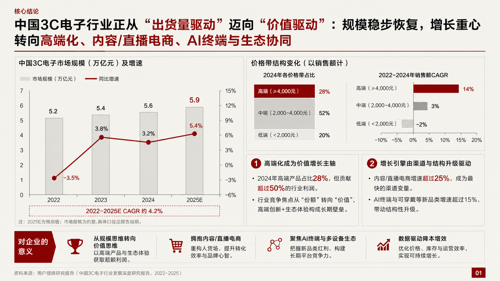
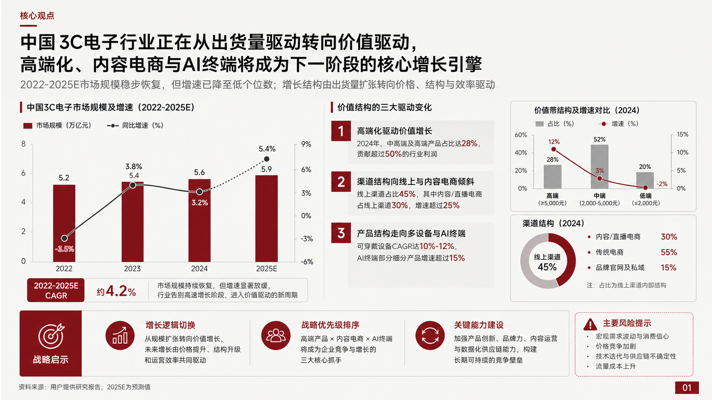
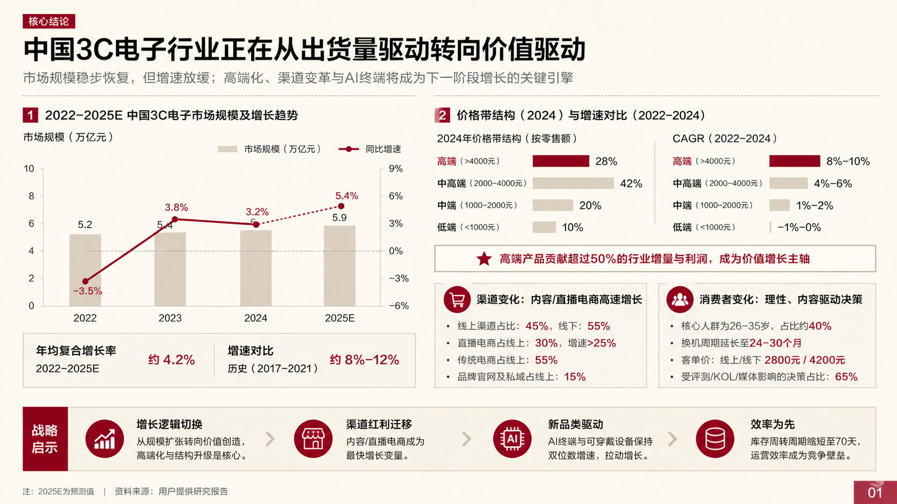
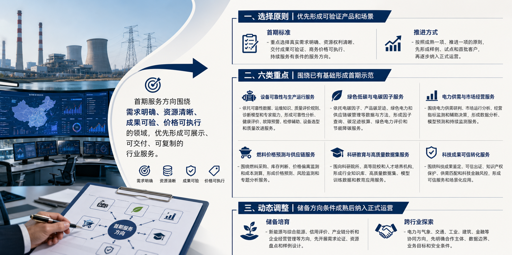
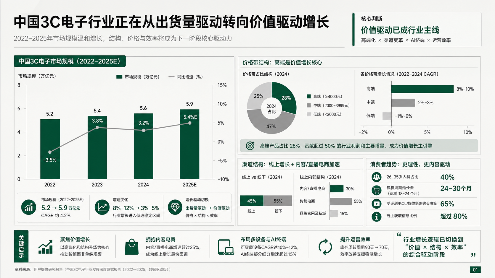
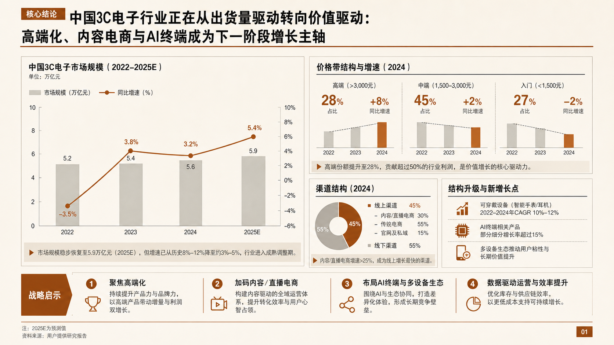
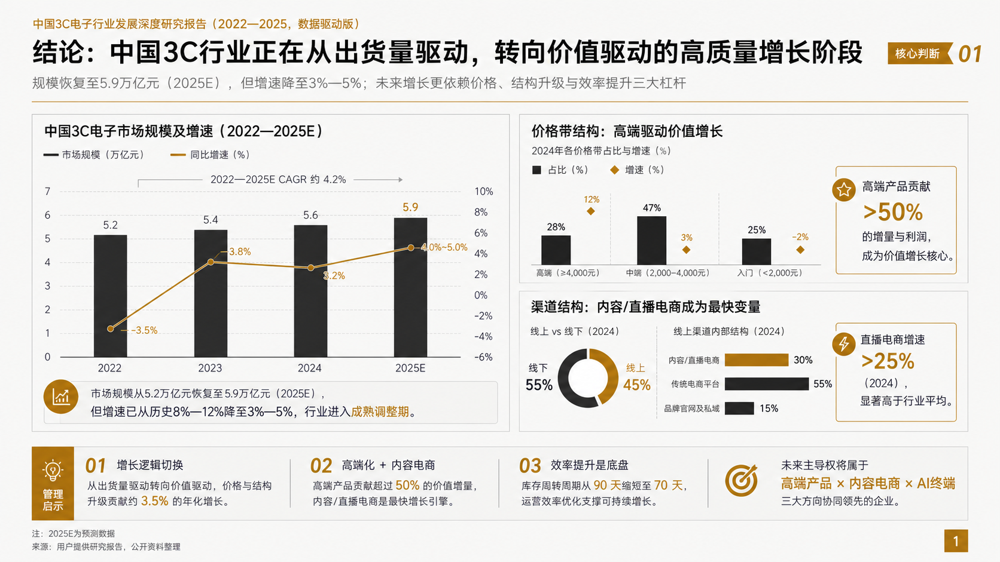
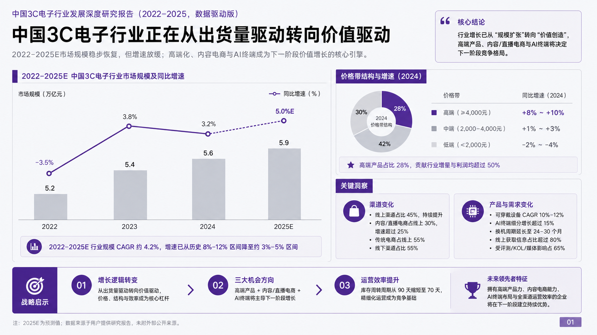

# CyberPPT

[简体中文](README.md) | [繁體中文](README.zh-TW.md) | [English](README.en.md) | [日本語](README.ja.md) | [한국어](README.ko.md) | [Français](README.fr.md) | [Português](README.pt.md) | [Español](README.es.md) | [العربية](README.ar.md)

CyberPPT 是一个 Codex Skill，用于把文档、研究材料、方案材料和业务数据转化为结构合宜、高密度、可审计的 PowerPoint 演示文稿。

适用场景：咨询风格 PPT，高信息密度，包括行业研究、消费品分析、品牌战略、电商分析、用户研究、高管汇报、董事会材料、客户提案和项目复盘。 不适用场景：字少的低信息密度风格，包括演讲、个人风格表达、叙事、分享、观点类 PPT。

CyberPPT 的核心不是“套模板”，而是把源材料先转成可审计证据链，再按材料类型选择方案型或咨询型架构，通过页面密度规划、视觉蓝图和严格门禁生成 PPTX。方案、研究、建设、实施和立项材料默认使用 `solution`；`consulting` 与 SCR 仅在明确选用时启用。

## 核心能力

- 从 DOCX、PDF、TXT、XLSX、研究报告、业务材料和原始数据中提取证据、事实、数字、判断和 caveat。
- 建立 MBB 标准证据表，再做内容脑暴、故事线比较、SCR 收敛和逐页页面计划。
- 默认提供 8 种固定 CyberPPT 视觉风格，每种风格都有独立 16:9 样张。
- 生成逐页正文内容区 ImageGen 蓝图，用于锁定正文区构图、层级、密度、色板和图表语言；标题、副标题和公共模板元素由模板/可编辑文字层生成。
- 使用“复杂视觉保真 + 主要文字可编辑”的混合还原策略生成 PPTX。
- 第三阶段默认使用 `dual_image_editable_overlay`（无文字底图 + 主要文字可编辑）；只有用户明确要求背景图表、表格、箭头、图标等对象级可编辑时，才升级到 `native_rebuild`。该模式必须先编译最终交付成稿 prompt，不得把证据编号、caveat、标题占位条或调试标记画入生成图。
- 执行结构 QA、视觉 QA、可编辑性 QA、容器溢出 QA、空间锚点 QA 和曲线追踪 QA。

## 强制流程

1. 分析：建立 MBB 证据表，记录冲突、缺口和 caveat；脑暴 2-3 条故事线，收敛为 SCR、逐页大纲、图表计划、信息密度和组件清单。
2. 蓝图：展示 8 种固定视觉风格；用户选择后锁定风格编号、色板、正文区网格、图表语言和页面密度，并生成逐页正文内容区 ImageGen 蓝图。
3. 还原：默认把已批准正文区蓝图晋升为 full 候选，只派生无文字 background 并套模板；只有 full 候选不合格时才基于蓝图定向重绘。
4. 交付：提供 PPTX、全页渲染图、`slide_manifest.json`、`visual_qa_gate.json` 和 strict QA 结果。任一关键门禁失败，不得交付确认。

## 8 种视觉风格

| 选项 | 名称 | 样张 |
|---|---|---|
| 01 | 经典深红咨询风 |  |
| 02 | 冷灰 + 勃艮第红 |  |
| 03 | 暖象牙白 + 暗酒红 |  |
| 04 | 象牙白 + 深蓝强调 |  |
| 05 | 浅灰白 + 墨绿 |  |
| 06 | 纸张米色 + 铜棕 |  |
| 07 | 纯净浅灰 + 黑金 |  |
| 08 | 冷白灰 + 深紫 |  |

## 门禁机制

CyberPPT 内置多层门禁，防止“文件生成了，但证据、密度、可编辑性或视觉还原不合格”。

| 门禁 | 检查什么 | 失败后怎么处理 |
|---|---|---|
| Reference Gate | 每个阶段开始前是否读取对应 reference 文件 | 未读取不得进入阶段 |
| Evidence Gate | 所有事实、数字、判断、建议是否可追溯到源材料 | 缺证据必须标记缺口或返工 |
| Storyline Gate | 是否完成 2-3 条故事线脑暴、比较和 SCR 收敛 | 不能只交单版大纲 |
| Communication Strategy Gate | 是否在提纲前确认沟通对象、沟通目的、决策任务和汇报方向 | 用户未选择方向，或提纲未绑定已选策略时不得继续 |
| Density Gate | 每页是否有信息密度、组件清单、图表计划和 SO WHAT | 低密度页面必须补充或重排 |
| Style Gate | 是否展示 8 张独立 16:9 风格样张，并锁定选定风格 | 不能只给文字风格说明 |
| Blueprint Gate | 是否为全部页面生成逐页正文内容区 ImageGen 蓝图 | 蓝图未确认不得进入 PPTX |
| Asset Admission Gate | 每页图片资产是否有来源、必要性和可编辑性影响说明 | 无必要性的图片必须改为原生重建 |
| Editable Layer Gate | 主标题、正文、关键数字、图表标签、页脚、SO WHAT 是否可编辑 | 主要信息图片化即失败 |
| Visual Semantics Gate | 图表语义、曲线、面板系统、底色、层级和视觉重心是否忠实蓝图 | 不能用“可编辑”解释视觉降级 |
| Curve Trace Gate | 流线、弧线、异形边界、Ribbon、桑基图等是否精确追踪 | 粗略矩形、少点折线或默认曲线失败 |
| Spatial Registration Gate | 图标、节点、标签、箭头、曲线是否按锚点对齐 | 没重叠不代表位置合格 |
| Container Overflow Gate | 文字是否越过卡片、单元格、结论条、SO WHAT 或图表区 | 容器内溢出即失败 |
| Typography Gate | 字号是否符合固定 C0/T1-T14 层级 | 不得用无限缩字解决密度 |
| Render QA Gate | 是否逐页渲染并与蓝图对照 | 文件生成成功不等于完成 |
| Strict QA Gate | `validate_pptx.py --strict` 是否通过 manifest 和 visual QA 检查 | 出现 errors 必须返工 |

关键原则：`结构可编辑` 和 `视觉还原` 是同等硬门槛；`strict QA` 通过不等于视觉合格；ImageGen 蓝图是参考，不是最终 PPT 背景。

## 安装

使用 Git 将 CyberPPT 安装到 Codex skills 目录，并保持目录名为 `cyber-ppt`。文件夹根目录必须包含 `SKILL.md`。

```powershell
git clone https://github.com/crazyykhllc-bit/CyberPPT.git "$env:USERPROFILE\.codex\skills\cyber-ppt"
```

## 更新

```powershell
cd "$env:USERPROFILE\.codex\skills\cyber-ppt"
git pull
```

## PPTX 校验

```bash
python scripts/validate_pptx.py path/to/deck.pptx --manifest path/to/slide_manifest.json --visual-qa path/to/visual_qa_gate.json --strict --json-out path/to/report.json
```

## 本地工程入口

仓库同时提供 Python CLI、npm scripts 和 Makefile。`SKILL.md` 仍是工作流契约；CLI 只负责项目初始化、脚本确认门和仓库脚本的稳定入口。

目录归整规则见 [docs/repository-layout.md](docs/repository-layout.md)。正式项目优先放在 `projects/<project-name>/`，临时运行可放在 `image2pptx_runs/`；根目录 `images/` 只作为历史 scratch 位置，不再作为新流程默认输出目标。

```bash
python3 -m cyberppt doctor
python3 -m cyberppt init projects/example
python3 -m cyberppt prepare-communication-strategy projects/example
python3 -m cyberppt communication-strategy-check projects/example
python3 -m cyberppt approve-communication-strategy projects/example --option decision_review
python3 -m cyberppt source-truth-audit projects/example --input projects/example/workbench/stages/01-analysis/source-truth.json
python3 -m cyberppt outline-audit projects/example --input projects/example/workbench/stages/01-analysis/outline.json
python3 -m cyberppt prepare-chapter-review projects/example --level outline
python3 -m cyberppt chapter-review-audit projects/example --level outline
python3 -m cyberppt stage-script projects/example --slide 1 --kind imagegen --phase draft --source prompt.md
python3 -m cyberppt approve-script projects/example --slide 1 --kind imagegen
python3 -m cyberppt script-status projects/example --slide 1 --kind imagegen
python3 -m cyberppt final-script-pages projects/example --script workbench/scripts/final/script-final.md --pages 7-8
```

若脚本来自仓库外部、另一个项目或人工编辑，可在 Stage 02 直接接收：

```bash
python3 -m cyberppt final-script-pages projects/example --script /path/to/external-script.md --pages 1-8 --style-id 4 --external-script
```

`--external-script` 只解除 Stage 01 审批、视觉结构交接和逐页 ImageGen 台账的输入绑定；如果项目路径不存在，还会先按标准模板创建 CyberPPT 项目。Stage 02 仍会解析页面、生成风格锁、写入 manifest、构建上下文和 artifact ledger，并记录 `source_mode=external_script`、项目是否新建及外部脚本 SHA-256。默认不带该参数时，原有 Stage 01 门禁保持不变。

`final-script-pages` 默认按 `build_id` 创建新的构建目录，不覆盖既有版本；`workbench/artifact-ledger.json` 以追加方式记录每次产物，并用 `supersedes` 连接同一路径的历史版本。PPTX 导出必须使用本次运行的明确输出路径，导出工程同时写入 `analysis/export_artifact.json`，续跑不会按文件修改时间猜测旧 PPTX。提示词发送默认 `--prompt-enrich off`，即消费已批准 Prompt 原文；只有明确指定 `deterministic` 或 `send` 才会进行发送时增强。

`source-truth.json` 是第一阶段证据底稿的结构化事实源。`source-truth-audit` 在大纲设计之前检查原子证据、精确定位、P0/P1/P2语义梯度、数字、表格、状态边界和双向追溯，生成 `00-source-analysis.md`；长材料若只有P0/P1、没有足够P2细节层，会以 `SOURCE_PRIORITY_HIERARCHY_FLAT` 阻断。完整保留不等于等权上屏：Outline仅把P0/P1组织为少量主辅模块，P2进入 `detail_refs` 供完整文字稿、备注和追溯使用。

在此之前，语义理解阶段必须产出 `semantic-argument-model.json`（嵌入 `semantic-understanding.md` 的 `cyberppt.semantic_argument_model.v1`）。它固化 `document_semantics`、源材料主论点、章节论点、`argument_weight`（核心/支撑/细节/约束）、论证关系、主体、状态、MECE 分区和 `source_gaps`；论证关系的 `weight_effect` 固定为 `none`，不能把“支持关系”误读成“支撑层”。提纲只消费它，不得从 `S###` 证据清单重新猜论点；源材料单列的“行业优势与合作价值”必须保持为“中电联有什么能力、有何优势及合作价值”的核心论点。模型出现问号编码损坏、空证据或文档语义漂移时，Stage 00 直接阻断。严格提纲页必须声明 `primary_argument_node_id`、`source_argument_node_ids`、`source_argument_node_roles`、`source_argument_node_weights` 和 `core_message_derivation.argument_node_ids`，`outline-audit` 会检查节点的主消费者、角色/权重复制、无依据合并和论点反向追溯。

`communication-strategy` 是语义理解与提纲之间的真实人工确认门。候选文件必须明确沟通对象、沟通目的、决策任务和 2-3 个结构原则不同的汇报方向；检查通过后生成中文确认稿，用户选择一个 `option_id` 才会写入审批记录。审批记录表达用户决定，不绑定文件哈希；后续提纲仍必须复制已批准的对象、目的、方向、架构模式和结构原则，任何一项漂移都会被 `outline-audit` 阻断。

`outline-audit` 返回 `0` 表示通过，`4` 表示生成代理必须读取 `retry_directive` 后换方向重写，`5` 表示默认三次尝试已耗尽、需要用户在升级报告的 2-3 个选项中决策，输入错误返回 `2`。审计合同、最新报告、逐次尝试和升级报告写入 `workbench/stages/01-analysis/`；CLI 不代替生成代理重写大纲。

正式方案提纲启用 `editorial_control_mode: required`：每个内容页除来源语义合同外，还必须声明真实的 `audience_question`、非空的 `must_not_include` 和 `split_risk`。`audience_question` 不能复述页面使命，`must_not_include` 用于隔离相邻页面内容；中高拆页风险必须解释，高风险未通过拆分或重构消除时不得批准。上述字段会进入人类可读提纲、章结构审阅输入和页面脚本收据，防止下游重新混页。

`chapter-structure-review` 是 Outline Audit 与人工确认之间的正式章级门禁。`prepare-chapter-review` 编译包含文档语义身份、叙事主命题和逐页内容关系的机器输入，并在 `review/` 创建 Markdown 审阅骨架；人或 Agent 完成章内推进、跨页重复、主次密度与消费状态审阅后，由 `chapter-review-audit` 检查章节/页面覆盖、必需 Markdown 小节、消费状态和输入哈希。JSON 仅作为机器合同，Markdown 是人工审阅权威稿；大纲或脚本变化会使旧审阅失效。

Stage 01 脚本批准后，主流程自动调用仓库注册的 `vendor/skills/ppt-visual-structure-designer`。先运行 `prepare-visual-structure`，由 Agent 按 Skill 的 `workbench-handoff` 合同生成 `visual/` 四项产物，再运行 `visual-structure-audit` 绑定当前脚本哈希。该闸门通过前，`final-script-pages` 会阻断风格选择、生图和 PPT 生产。

常用开发检查：

```bash
make doctor
make test
make test-validate-pptx
```

## 许可

MIT。详见 [LICENSE](LICENSE)。

## Acknowledgments

[SVG Repo](https://www.svgrepo.com/) · [Tabler Icons](https://github.com/tabler/tabler-icons) · [Simple Icons](https://github.com/simple-icons/simple-icons) · [Phosphor Icons](https://github.com/phosphor-icons/core) · [Robin Williams](https://en.wikipedia.org/wiki/Robin_Williams_(designer)) (CRAP principles)
