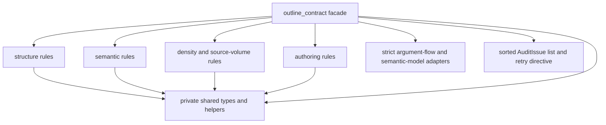

# refactor: Split Outline audit rules by responsibility

## Goal Capsule

- **Objective:** Split the rules now concentrated in `cyberppt/outline_contract.py` into internal responsibility modules without changing Outline audit behavior.
- **Authority:** Preserve the existing Stage 01 contract, public imports, audit codes, messages, page attribution, retry strategies, evaluation order, and sorted output.
- **Stop conditions:** Stop if the extraction requires changing an Outline JSON field, a command/CLI contract, or an existing audit result rather than exposing a pre-existing defect.
- **Execution profile:** Behavior-preserving refactor with characterization coverage before extraction.

---

## Product Contract

### Summary

The compiler must continue to mark its result as a mechanical candidate, and formal audit must continue to require professional author editing when author-driven mode is enabled.

The change improves maintainability only. It must not create a second audit workflow, a new CLI, an artifact, a dependency, or a new authoring gate.

### Problem Frame

`cyberppt/outline_contract.py` currently combines title, template, content, authoring, density, source derivation, semantic, and strict argument-flow checks in one large module.

This makes a localized rule change costly to locate and increases the chance that an unrelated audit family is changed accidentally.

### Requirements

- R1. Retain `cyberppt.outline_contract` as the public audit facade, including `AuditIssue`, `load_outline`, `resolve_architecture_mode`, `audit_outline`, and `retry_directive`.
- R2. Partition internal checks into structure/lexical redundancy, semantic, density/source-volume, and authoring responsibility modules with a neutral shared helper/type layer that cannot form an import cycle.
- R3. Preserve every emitted issue's code, message, pages, retry strategy, multiplicity, evaluation preconditions, and final order.
- R4. Preserve legacy, strict, semantic-model, source-truth, consulting-route, and author-driven behavior, including `OUTLINE_AUTHOR_EDIT_REQUIRED` for an unedited mechanical candidate.
- R5. Preserve canonical Outline field names and all existing command, CLI, and autonomous-flow consumers.
- R6. Add characterization coverage that proves representative complete audit and retry outputs before and after the module extraction.

### Scope Boundaries

- In scope: private Python module extraction, facade rewiring, focused tests, and graph refresh after code changes.
- Out of scope: changing audit thresholds or messages, revising Stage 01 authoring policy, restructuring `argument_flow_contract.py`, renaming Outline fields, or changing CLI output.
- Deferred to Follow-Up Work: independently revisiting whether any particular audit rule is useful or should be simplified.

---

## Planning Contract

### Key Technical Decisions

- KTD1. **Keep one public facade.** `outline_contract.py` remains the only supported import surface and the only aggregation/sort owner. Private rule modules are implementation details, so command-layer patches and direct test imports keep working.
- KTD2. **Move shared primitives below the facade.** Put `AuditIssue` and common page/text helpers in a neutral private module, then re-export `AuditIssue` from the facade. Rule modules must not import the facade.
- KTD3. **Retain dispatcher sequencing exactly.** The facade keeps the current special-case architecture check, rule-family call order, semantic-model conditional, strict-flow conditional, and final sort. Rule movement alone must not alter the externally visible sequence consumed by command reports and `retry_directive()`.
- KTD4. **Characterize outcomes, not private helper names.** Golden assertions compare full `AuditIssue` projections and retry directives across mode/input combinations. Existing rule-specific tests remain the detailed diagnosis coverage.

### High-Level Technical Design

### Definitive Rule Ownership

| Module | Functions or responsibility | Boundary |
|---|---|---|
| `cyberppt/outline_audit_shared.py` | `AuditIssue`; page/text/message helper functions; shared constants | Imports no audit-rule module and exposes no new public contract. |
| `cyberppt/outline_audit_structure.py` | title-style, template, content/page-shape checks; consulting/solution route helpers | Owns structural validity plus lexical and page-field redundancy checks. |
| `cyberppt/outline_audit_authoring.py` | editorial-control and author-driven checks | Keeps the mechanical-candidate stop result exclusive and content-page scoped. |
| `cyberppt/outline_audit_density.py` | source-weight, source-volume, low-density-run checks | Owns source-volume arithmetic and density thresholds only. |
| `cyberppt/outline_audit_semantics.py` | semantic derivation, document semantics, content-unit contract, structural argument duty checks | Receives resolved `pages` and optional `source_truth`; does not perform facade aggregation. |
| `cyberppt/outline_contract.py` | load/resolve public helpers, adapter imports, ordered aggregation, strict/model conditionals, final sorting, retry directive | Remains the stable consumer-facing module. |

### Assumptions

- The existing issue text is contractual because command JSON and retry guidance expose it to users.
- Any difference revealed by characterization is treated as a regression unless an existing test and product owner establish that it is a defect correction.

### Risks & Dependencies

- Import cycles are the principal extraction risk. The shared module must not import the facade, and strict/model adapters remain in the facade.
- Sorting occurs after aggregation, but issue multiplicity and retry-strategy first-occurrence order remain observable. The extraction must preserve both.
- The worktree contains unrelated changes, including `cyberppt/script_quality_contract.py` and untracked skill/plan material. The implementation must neither edit nor stage them.

---

## Implementation Units

### U1. Characterize the current public audit contract

- **Goal:** Freeze representative public results before moving rule bodies.
- **Requirements:** R1, R3, R4, R6.
- **Dependencies:** None.
- **Files:** `tests/test_outline_contract.py`, `tests/test_outline_audit_command.py`.
- **Approach:** Add a compact fixture or parameterized cases that build outlines/source truth/models through the public facade. Assert the full ordered projection `(code, message, pages, retry_strategy)` and the resulting `retry_directive()` payload. Build a rule-family coverage matrix that maps every moved helper to an existing assertion or a compact fixture. Reuse existing realistic outline builders where they already cover the required contract shape.
- **Patterns to follow:** Existing direct facade tests in `tests/test_outline_contract.py`; command-level model-loading test in `tests/test_outline_audit_command.py`.
- **Test scenarios:**
  - A legacy outline with no source truth or semantic model returns its existing issue sequence without strict-only issues.
  - A strict outline without source truth includes `SOURCE_TRUTH_REQUIRED` at its current sorted position.
  - A strict outline with source truth preserves argument-flow issue conversion and retry strategy.
  - A required semantic-model outline preserves the missing-model result and a supplied model preserves consumption issues without duplicate command reporting.
  - A global issue with no page attribution sorts before page-specific issues, and its retry directive preserves code/strategy ordering.
  - The coverage matrix accounts for title, template, content, authoring, source-weight, density, document-semantic, derivation, content-unit, and structural-duty rule families before their bodies move.
- **Verification:** The new tests prove public issue and retry equality without importing a private rule module.

### U2. Establish private shared primitives and extract structural rules

- **Goal:** Create the acyclic foundation and move page-shape rules without changing facade exports.
- **Requirements:** R1, R2, R3, R5.
- **Dependencies:** U1.
- **Files:** `cyberppt/outline_contract.py`, `cyberppt/outline_audit_shared.py`, `cyberppt/outline_audit_structure.py`, `tests/test_outline_contract.py`.
- **Approach:** Relocate the dataclass and helpers required by multiple rule families to the neutral module; re-export `AuditIssue` from `outline_contract.py`. Extract title-style, template, content, lexical n-gram, and page-field redundancy checks as a cohesive structural module. Preserve existing function inputs and return types internally, and leave the facade responsible for page normalization and aggregation.
- **Patterns to follow:** The current facade behavior in `cyberppt/outline_contract.py`; direct imports used by `cyberppt/commands/outline_audit.py`.
- **Test scenarios:**
  - Existing formal-title, chapter/template sequence, title/core-message, repeated-question, necessity, and n-gram redundancy tests remain green.
  - Direct imports of `AuditIssue`, `load_outline`, `resolve_architecture_mode`, `audit_outline`, and `retry_directive` from the facade remain valid.
  - A malformed or non-list `pages` value still normalizes to the current empty page set.
  - Explicit consulting route and implicit solution route preserve their current outcome.
- **Verification:** The public module imports cleanly and the structural characterization cases match U1's expected projections.

### U3. Extract authoring, density, and semantic rule families

- **Goal:** Complete responsibility-based extraction while keeping source-truth and authoring conditions intact.
- **Requirements:** R2, R3, R4, R5.
- **Dependencies:** U2.
- **Files:** `cyberppt/outline_contract.py`, `cyberppt/outline_audit_authoring.py`, `cyberppt/outline_audit_density.py`, `cyberppt/outline_audit_semantics.py`, `tests/test_outline_contract.py`, `tests/test_stage01_compiler.py`.
- **Approach:** Move the two authoring families, source-weight/density checks, and semantic/source-truth checks to their assigned modules. Keep semantic-model consumption and strict argument-flow adaptation in the facade because those paths integrate external contracts and determine ordered aggregation. Pass optional inputs through unchanged instead of normalizing them inside each rule module.
- **Patterns to follow:** Candidate-to-author gate in `tests/test_stage01_compiler.py`; optional source-truth guards and strict-mode path in the current facade.
- **Test scenarios:**
  - `author_driven` plus a non-`author_edited` status produces only `OUTLINE_AUTHOR_EDIT_REQUIRED` from the author-driven family.
  - An authored content page reports each currently required authoring field, while non-content pages do not receive those field issues.
  - Density checks skip cleanly when source truth is absent or insufficient and retain existing low-density detection when records are provided.
  - Semantic derivation, document semantics, content-unit, and structural-duty issues match current results with and without source truth.
  - The Stage 01 generated mechanical candidate still fails formal audit until the existing author fields are populated.
- **Verification:** U1's full-output cases and the existing Stage 01 gate test pass after all three families move.

### U4. Rewire consumers and validate the complete contract

- **Goal:** Confirm real command, CLI, and autonomous consumers retain the same behavior, then refresh repository graph metadata.
- **Requirements:** R1, R3, R4, R5, R6.
- **Dependencies:** U3.
- **Files:** `cyberppt/outline_contract.py`, `tests/test_outline_audit_command.py`, `tests/test_cli.py`, `tests/test_run_autonomous.py`, `graft/` generated graph files if the graph build updates them.
- **Approach:** Keep consumer imports unchanged. Exercise command loading and reporting through existing test paths, including command-layer patch seams. Rebuild the Graft graph only after code changes, then check it. Do not add workflow files or modify unrelated working-tree changes.
- **Patterns to follow:** `cyberppt/commands/outline_audit.py` and autonomous prerequisite checks in `cyberppt/commands/run_autonomous.py`.
- **Test scenarios:**
  - The outline-audit command passes its loaded semantic model to the facade and reports issues once.
  - The CLI continues to expose `outline-audit` and a compiled mechanical candidate continues to be blocked before author editing.
  - The autonomous path recognizes the unchanged author-edited requirement.
  - Full-suite output has no new failures attributable to this refactor.
- **Verification:** Targeted consumer tests, the full repository test suite, and Graft validation complete successfully.

---

## Verification Contract

| Gate | Applies to | Done signal |
|---|---|---|
| Characterization suite | U1-U3 | Ordered issue projections and retry directives match the frozen expectations. |
| Focused Stage 01 audit tests | U1-U4 | `PYTHONPATH=. pytest -q tests/test_outline_contract.py tests/test_stage01_compiler.py tests/test_outline_audit_command.py tests/test_cli.py tests/test_run_autonomous.py` passes. |
| Full regression suite | U4 | `PYTHONPATH=. pytest -q` passes, or any pre-existing failure is isolated and reported. |
| Graph validation | U4 | `npx --no-install graft build` followed by `npx --no-install graft check` reports a valid graph. |

---

## Definition of Done

- The public facade and all current command imports remain compatible.
- The four responsibility modules exist with no circular imports, and lexical/page-field redundancy remains owned by structure while source-volume density remains owned by density.
- The dispatcher retains exact aggregation conditions, final sort, and retry behavior.
- Mechanical candidate authoring and strict/legacy/model/source-truth paths retain their current audited outcomes.
- Focused and full regression gates pass, and the graph is rebuilt and valid.
- The final diff excludes unrelated working-tree changes and contains no abandoned extraction scaffolding.

---

## Sources & Research

- `cyberppt/outline_contract.py` — current public facade, ordered dispatcher, and retry behavior.
- `cyberppt/commands/outline_audit.py` — consumer import/patch seam and report handling.
- `tests/test_outline_contract.py`, `tests/test_stage01_compiler.py`, `tests/test_outline_audit_command.py` — existing contract and end-to-end Stage 01 coverage.
- `docs/superpowers/specs/2026-07-26-stage01-content-stability-design.md` — strict/legacy compatibility requirement.
- `docs/superpowers/specs/2026-07-26-stage01-contract-consumption-design.md` — one existing audit entrypoint and canonical field preservation.
