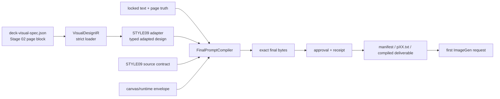

# STYLE09 结构化适配器与最终提示词编译器实施计划

## Goal Capsule

在不整仓回退、不改动第一期 Stage 02 Agent Skill/Schema 的前提下，恢复 STYLE09 及其风格适配职责：完整保留 Stage 02 已产出的业务对象、关系、场景角色和文字附着语义，由类型化 STYLE09 适配器把这些语义转成正式政企视觉语言，并由唯一的最终提示词编译器一次性生成、审批、记录和发送完全相同的提示词字节。

目标不是复原旧版字符串拼接代码，而是恢复旧版有效职责并修正当前语义压扁、STYLE09 重复拼接、审批早于最终编译、运行时再次加壳等结构性问题。

## Product Contract

### Requirements

- **R1 — 保留 Stage 02 设计权威。** 第一阶段保持 `vendor/skills/ppt-visual-structure-designer/` 的 Skill、Schema 和现有执行回执不变；从 `deck-visual-spec.json` 严格加载完整页面语义，不在 STYLE09 层重新选择页面布局或业务关系。
- **R2 — 恢复 STYLE09 适配职责。** 新增类型化适配器，将 Stage 02 语义映射为 STYLE09 的语义锚点、业务对象、场景角色、关系表达、文字附着、层级和禁用项；不得恢复旧版 Markdown 前缀、分号拆分或关键词选版逻辑。
- **R3 — 业务语义完整、上屏文字受控。** `visual_thesis`、`business_object`、`semantic_role`、`scene_type`、`relationship_encoding` 等完整语义作为 `NON-ONSCREEN MODEL CONTEXT` 进入模型上下文；只有锁定文字白名单允许作为业务文案上屏，备注、原因和解释不得转成新增可见事实。
- **R4 — 唯一最终编译器。** 生产链只允许一个最终提示词序列化器；Stage 02 适配结果在 STYLE09 风格合同之前进入提示词，STYLE09 正式合同只出现一次，终态锁只出现一次且位于绝对末尾。Manifest 只负责编排和持久化，不再追加、重排或修补 STYLE09 文本。
- **R5 — 审批绑定实际发送字节。** 完整编译完成后再审批；审批和运行记录至少绑定最终提示词、锁定文字、页面视觉块、STYLE09 合同、适配器/编译器版本、生产模式和运行时信封的哈希。首轮发送时，提示词文件、Manifest、编译产物与实际请求字节必须一致；重试需保留前一轮哈希链。
- **R6 — 严格来源策略。** 对受治理或新项目，存在 `deck-visual-spec.json` 但缺页时必须硬失败；Markdown 视觉提示只允许显式 legacy 模式使用，同一批次不得混用 JSON 与 Markdown 来源。
- **R7 — 保持兼容边界。** 非 STYLE09、显式 legacy 和现有调用方在约定范围内保持行为；旧字符串 API 可作为薄兼容包装，但不得继续承担生产编译职责。
- **R8 — 以真实生成质量验收。** 适配器完成后先做小样本可行性 A/B，代码链完成后再对两个不同主题项目进行固定样本、盲评和同参数终验；评价业务对象与关系忠实度、场景具体性、文字授权、层级和正式感，不以提示词长度或像素金图替代视觉验收。
- **R9 — 改动范围克制。** 仅改现有单机编译链，不新增服务、数据库、配置子系统、平行生命周期或轻量 Stage 01 用户门禁；不手工修补项目生成图代替修复上游代码。

### Key Technical Decisions

- **KTD1.** 恢复 STYLE09 与对应适配器的“职责”，不恢复旧版字符串实现。`(session-settled: user-approved — chosen over 整仓回退、保留当前通用语义压缩、或复原旧版 Markdown/关键词适配器；原因是视觉优势来自业务语义与风格语言的耦合，而不是旧实现形式。)`
- **KTD2.** Stage 02 决定“表达什么”，STYLE09 适配器决定“以 STYLE09 表面语言如何表达”，最终编译器决定“以什么顺序形成唯一可发送文本”。`(session-settled: user-directed — chosen over 让 STYLE09 重新决定页面关系或让 Manifest 继续字符串拼接。)`
- **KTD3.** 第一阶段不修改 Stage 02 Agent Skill/Schema。`(session-settled: user-approved — chosen over 先改 Agent 协议；现有 Schema 已能表达所需语义，改动会不必要地使 skill bundle、请求和执行回执失效。)`
- **KTD4.** `use_scene=false` 不等于“不要场景”；适配器将其编译为业务关系场/抽象承载场，而不是通用的 `no scene`。`(session-settled: user-directed — chosen over 当前把非叙事页压扁为无场景通用卡片。)`
- **KTD5.** 审批对象是最终可发送字节，不是早期 canonical prompt。`(session-settled: user-directed — chosen over 先审批、后富化、后拼接 STYLE09、发送时再加 canvas contract 的现状。)`

### Scope Exclusions

- 不回退整个分支或恢复历史提交快照。
- 不在第一期修改 `vendor/skills/ppt-visual-structure-designer/`、Skill Schema 或 Stage 02 Agent 的风格选择约束。
- 不改变 Stage 01 其他脚本类型的意图式审批语义；只在现有 `script_gate.py` 中为 ImageGen/`imagegen-send` 增加 kind-specific 精确哈希校验，并加固对应机器回执。
- 不建立新的审批文件体系、服务、数据库、运行目录或配置中心。
- 不把具体两页的图像结果作为代码正确性的唯一依据，也不手工修图掩盖编译问题。
- 不清理、覆盖、回退当前工作区中与本任务无关的未提交变更或生成产物。

## Planning Contract

### Architecture Boundary



职责边界：

| 层 | 负责 | 不负责 |
|---|---|---|
| Stage 02 | 页面业务对象、关系、场景用途、空间组织、文字附着建议 | 选择 STYLE09、拼完整提示词 |
| `VisualDesignIR` | 无损承载和校验 Stage 02 页面语义 | 风格决策、字符串拼接 |
| STYLE09 adapter | 将页面语义映射为 STYLE09 可执行视觉语言 | 决定新的业务逻辑、输出完整风格合同 |
| `FinalPromptCompiler` | 唯一排序、序列化、终态锁、运行信封 | 审批策略、Manifest 编排 |
| Approval/Manifest/Runtime | 审批最终字节、记录来源和按原字节发送 | 编译后再次追加或修补提示词 |

### Compatibility Policy

1. 受治理项目、新项目和声明 `visual_structure_required` 的项目必须使用 JSON 页面块；缺页或无效字段立即失败。
2. 显式 legacy 项目可读取 `generation-prompts.md`，并记录 `source_mode=legacy_markdown`。
3. 一个 Manifest 批次只能有一种视觉来源模式；检测到混用时拒绝生成。
4. 旧 `VisualPromptModule` 字符串接口只作为兼容包装，内部委托新 loader/adapter；生产路径不得反向解析其字符串。

### Dirty Worktree Policy

实施前先保存以下文件的语义 diff 和当前测试基线，随后逐文件合并，禁止 `git checkout --`、`git reset --hard`、整文件覆盖和无关格式化：

- `cyberppt/visual_prompt_consumer.py`
- `scripts/dual_image_overlay/deliverable_prompt.py`
- `scripts/dual_image_overlay/imagegen_handoff.py`
- `scripts/dual_image_overlay/cyberppt_pair_manifest.py`
- `scripts/dual_image_overlay/prompt_approval.py`
- `cyberppt/commands/final_script_pages.py`
- 对应测试文件

每个实施单元只提交本单元经过验证的路径；项目目录中的生成图、运行记录和其他用户改动不进入代码提交。

## Implementation Units

### U1 — 当前字节链与回归行为的特征化

**Outcome:** 用测试固定当前生产链的真实行为和预期新合同，避免在脏工作区中误覆盖既有改动。

**Files:**

- `tests/test_visual_prompt_consumer.py`
- `tests/test_dual_image_overlay_pair_manifest.py`
- `tests/test_final_script_pages.py`
- `tests/test_extended_style_9.py`
- `tests/test_imagegen_creative_brief.py`

**Work:**

1. 保存上述生产文件的当前 diff、调用图和基线测试结果。
2. 增加失败特征测试：页面语义字段被通用摘要替代、STYLE09 可能重复、审批哈希早于最终编译、发送时 canvas contract 导致字节不一致。
3. 区分本任务失败与既有环境失败；路径规范化、缺少 `cv2` 等环境问题单独记录，不通过修改业务断言规避。

**Requirements:** R3, R4, R5, R9.

**Verification:** 新增测试在现状上能准确暴露目标回归；无生产代码改动。

### U2 — 建立无损 `VisualDesignIR` 与严格加载策略

**Outcome:** Stage 02 页面语义从 JSON 无损进入编译链，缺页和隐式回退不再被吞掉。

**Files:**

- `cyberppt/visual_prompt_consumer.py`
- `tests/test_visual_prompt_consumer.py`

**Work:**

1. 新增不可变 `VisualDesignIR`，至少承载 `visual_thesis`、`business_object`、`primary_focus`、`spatial_organization`、`relationship_encoding`、`text_integration_method`、`semantic_role`、`use_scene`、`scene_type`、`spatial_grammar`、`avoid` 及来源哈希。
2. 新增严格 loader，例如 `load_visual_design(project, page_code, allow_legacy=False)`；JSON 存在但缺页时硬失败。
3. 保留 `VisualPromptModule` 为兼容包装；移除生产侧把具体语义编译为“unique focus / no decorative scene / path / convergence”等通用字符串的职责。
4. 为显式 legacy 返回清晰的来源元数据，不允许生产批次隐式混用。

**Requirements:** R1, R3, R6, R7.

**Verification:** 每个语义字段均有 round-trip/快照断言；`use_scene=false` 仍保留场景类型和关系字段；缺页、无效 JSON、显式 legacy 和混用分别有测试。

### U3 — 新建类型化 STYLE09 适配器与单一风格合同

**Outcome:** 恢复 STYLE09 对正式语气、材质、克制纵深、信息质量和场景表达的控制，但不侵占页面业务设计权。

**Files:**

- `scripts/dual_image_overlay/style09_adapter.py`（新增）
- `scripts/dual_image_overlay/style_prompt_contract.py`（新增，若现有模块可清晰承载则并入 `deliverable_prompt.py`）
- `scripts/dual_image_overlay/deliverable_prompt.py`
- `tests/test_style09_adapter.py`（新增）
- `tests/test_extended_style_9.py`
- `tests/test_visual_grammar.py`

**Work:**

1. 定义不可变 `Style09AdaptedDesign`：`semantic_anchor`、`business_objects`、`scene_role`、`relationship_expression`、`text_attachment`、`hierarchy`、`avoid`。
2. 实现纯函数 `adapt_style09(VisualDesignIR) -> Style09AdaptedDesign`；不读 Markdown、不解析分号、不选择卡片模板、不输出完整 STYLE09 合同。
3. 第一阶段只做确定映射：`use_scene=true → integrated_scene`，`use_scene=false → business_relationship_field`；禁止将 `use_scene=false` 编译成“no scene”。第三种场景策略只有在后续 Stage 02 协议能提供明确输入信号时才引入。
4. 统一 STYLE09 正文和终态锁的权威来源；旧 `style_contract()` 等接口变为薄代理，生产链不再靠 `enforce_style09_terminal_lock()` 做字符串手术。

**Requirements:** R2, R3, R4, R7.

**Verification:** 适配器快照覆盖场景页、纯逻辑页、图表页、高文字页；断言业务对象/关系/文字附着未丢失，STYLE09 正文和终态锁各有且仅有一个权威输出。

### U3 Gate — 早期视觉可行性检查

在进入 U4 前，从当前电力数据项目固定选择场景页、纯逻辑页和高文字页各 1 页；baseline 与 U3 candidate 使用相同模型、尺寸、质量档和运行参数，每个条件每页生成 2 个样本。只有当 candidate 在业务对象具体性、关系忠实度和场景职责三项中至少 2 页取得一致改善，且未增加未授权可见文字时，才继续 U4–U6。若未通过，仅迭代 U3 映射和 STYLE09 表面语言，不先迁移编译、审批和 legacy 链路。

### U4 — 收敛为唯一 `FinalPromptCompiler`

**Outcome:** 所有生产入口共享同一编译顺序，Manifest、compact、approved、send-agent 和运行时不再各自拼接提示词。

**Files:**

- `scripts/dual_image_overlay/imagegen_handoff.py`
- `scripts/dual_image_overlay/deliverable_prompt.py`
- `scripts/dual_image_overlay/cyberppt_pair_manifest.py`
- `cyberppt/commands/prepare_imagegen_send.py`
- `cyberppt/commands/final_script_pages.py`
- `tests/test_dual_image_overlay_pair_manifest.py`
- `tests/test_final_script_pages.py`
- `tests/test_imagegen_creative_brief.py`

**Work:**

1. 让 `compile_page_prompt()`（或等价重命名后的 `FinalPromptCompiler`）成为唯一生产编译入口。
2. 固定序列：页面追踪 → canvas/chrome 合同 → 页面事实与锁定文字 → `NON-ONSCREEN` 语义 → STYLE09 适配块 → 可选 send-agent enrichment 块 → STYLE09 正式合同 → 唯一终态锁。
3. `cyberppt_pair_manifest.py` 只读取编译结果和哈希，不再调用 `render_prompt()` 后追加 visual module、STYLE09 或终态锁。
4. `prepare_imagegen_send.py` 只生成受 Schema/边界校验的 enrichment 块，不直接改写完整候选提示词；`FinalPromptCompiler` 将该块插入 STYLE09 正式合同之前并完成唯一序列化。
5. 将 `BODY_IMAGE_CANVAS_CONTRACT` 移入最终编译器；删除 `final_script_pages.py` 发送前的二次 prepend，第一阶段不保留运行时信封例外。
6. 改造现有 ImageGen handoff 命令，使其物化并 stage 完整 `FinalPromptCompiler` 输出作为唯一评审批次，继续使用现有 stage-final/approve-script 交互；`build_manifest()` 只校验并消费已批准字节，不重新编译。

**Requirements:** R3, R4, R5, R7.

**Verification:** approved/unapproved、compact、send-agent、首轮运行时四条路径均断言：STYLE09 正文一次、终态锁一次且末尾、适配块在风格合同之前、无编译后字符串追加。

### U5 — 把审批、回执和重试绑定到最终字节

**Outcome:** 任何语义、文字、风格、适配器、编译器或运行信封变化都会使审批失效，运行记录可还原实际发送内容。

**Files:**

- `scripts/dual_image_overlay/prompt_approval.py`
- `scripts/dual_image_overlay/cyberppt_pair_manifest.py`
- `cyberppt/commands/prepare_imagegen_send.py`
- `cyberppt/commands/script_gate.py`
- 对应 ImageGen approval/gate 测试
- `cyberppt/commands/final_script_pages.py`
- 相关 approval、manifest、runtime 测试

**Work:**

1. ImageGen handoff 先物化并 stage 最终提示词，再通过现有 stage-final/approve-script 流程创建审批；Manifest 只验证并消费已批准字节。移除 `canonical_style09_refresh` 一类绕过历史审批的路径。
2. 扩展审批或机器编译回执，绑定 `final_prompt_sha256`、locked-text hash、页面视觉块 hash、style-lock hash、adapter/compiler version hash、production mode、runtime-envelope version。
3. 如当前回执已能直接提供 Stage 02 executor/model/run-id，则可补充 `skill_invocation_sha256`/`context_bundle_sha256`；否则本期不扩展 provenance 范围。未捕获完整请求时不得宣称可逐字回放 Agent 输入。
4. 首轮请求记录 `final_prompt_sha256`/`request_prompt_sha256`；纠错重试记录 `previous_attempt_sha256`，保留从批准版本到实际请求的链路。
5. 不新增轻量 Stage 01 人工门禁；在 `script_gate.py` 中仅对 `imagegen`/`imagegen-send` kind 校验 `approved_hashes` 与最终字节完全一致，其他脚本 kind 保持意图式审批语义；非门禁流写机器编译回执。

**Requirements:** R5, R9.

**Verification:** 修改任一受绑定输入都会触发 stale；首轮发送 hash 与批准 hash 相同；重试 hash 链可追踪；Manifest 不得通过覆盖 `consumed_prompt_sha256` 掩盖早期审批。

### U6 — 迁移兼容入口并关闭隐式 fallback

**Outcome:** 新项目和受治理项目只走结构化生产链，legacy 仍可显式使用但不会污染新链。

**Files:**

- `cyberppt/visual_prompt_consumer.py`
- `scripts/dual_image_overlay/cyberppt_pair_manifest.py`
- `scripts/dual_image_overlay/imagegen_handoff.py`
- `cyberppt/cli.py`
- `cyberppt/commands/final_script_pages.py`
- `tests/test_visual_prompt_consumer.py`
- `tests/test_imagegen_no_visual_structure.py`
- `tests/test_dual_image_overlay_pair_manifest.py`

**Work:**

1. 在现有 CLI 增加 `--visual-source governed-json|legacy-markdown`，默认值由 `visual_structure_required(project)` 推导；该枚举经 `final_script_pages`、Manifest 传至 loader，不创建新配置子系统。
2. 对受治理项目：无 JSON、JSON 缺页、审计失效均硬失败；对显式 legacy：保留旧读取行为并标明来源。
3. Manifest 构建前验证整个批次的 `source_mode` 单一；禁止单页静默退回 Markdown。
4. 删除生产调用方对旧字符串模块的直接依赖，保留必要的外部兼容测试。

**Requirements:** R6, R7, R9.

**Verification:** governed/new、explicit legacy、mixed-source 三类集成测试齐全；非 STYLE09 路径的既有合同测试保持通过。

### U7 — 真实产物 A/B 与交付收口

**Outcome:** 证明新代码改善的是业务语义和 STYLE09 视觉执行，而不是只让测试或提示词长度发生变化。

**Files/Artifacts:**

- 当前电力数据项目及第二个不同主题现有项目的重新编译提示词与运行记录
- 场景页、纯逻辑页、图表页、高文字页的 A/B 图像
- 对比 QA 记录（放在项目现有 diagnostics/QA 位置，不新建平行产物体系）
- `cyberppt/image_text_gate.py` 及对应文字授权审计测试

**Work:**

1. 预先固定当前电力数据项目 5 页（覆盖场景、纯逻辑、图表和高文字）以及第二个不同主题现有项目 2 页（至少场景和纯逻辑）；baseline/candidate 每页每条件生成 3 个样本，模型、尺寸、质量档和其他运行参数一致。
2. 隐藏 baseline/candidate 标签并随机样本顺序，使用现有六个维度进行 5 分制盲评；candidate 必须在当前项目至少 4 页的业务对象、关系和场景职责中取得中位数改善，第二项目 2 页不得退化，文字准确性不得下降。
3. 扩展现有 `image_text_gate.py`，把“可读文字是否获得白名单授权”与错字/乱码分开审计；识别到 `NON-ONSCREEN` 语义短语可见或其他未授权业务文字时，该样本直接不接受。
4. 记录请求、回退、重试、完成时间、成功率、文字准确率、未授权文字率和视觉接受率；不把提示词长度当作生成速度解释。
5. 仅当代码测试、精确字节合同和人工视觉验收均通过后，才合并代码提交。

**Requirements:** R8, R9.

**Verification:** A/B 报告可追溯到相同页面输入和最终提示词 hash；覆盖两个主题、四类页面和预注册样本数，并给出盲评接受/拒绝理由。

## Verification Contract

### Automated Test Layers

1. **类型与适配器单测**

   ```bash
   PYTHONPATH=. pytest -q \
     tests/test_visual_prompt_consumer.py \
     tests/test_style09_adapter.py \
     tests/test_extended_style_9.py \
     tests/test_visual_grammar.py
   ```

2. **编译、Manifest、审批与运行时集成**

   ```bash
   PYTHONPATH=. pytest -q \
     tests/test_dual_image_overlay_pair_manifest.py \
     tests/test_imagegen_creative_brief.py \
     tests/test_imagegen_no_visual_structure.py \
     tests/test_final_script_pages.py
   ```

3. **相关回归套件**

   使用仓库项目环境运行全部与 `visual_prompt_consumer`、`style09`、`dual_image_overlay`、`imagegen-send`、`final_script_pages` 相关的测试；缺少 `cv2` 等依赖时切换到仓库/工作区已配置 Python 环境，不以删除测试或放宽业务断言解决。

4. **工作区与提交检查**

   ```bash
   git diff --check
   git diff --ignore-space-at-eol -- cyberppt scripts/dual_image_overlay tests
   ```

### Required Invariants

- **V1:** `visual_thesis`、`business_object`、关系、场景类型、文字附着和 `avoid` 全部到达 `NON-ONSCREEN` 语义区。
- **V2:** 锁定文字白名单是唯一可渲染业务文案来源；说明性上下文不会新增事实、数字、组织、责任主体或结论。
- **V3:** `use_scene=false` 仍产生业务关系承载场，不出现通用 `no scene` 压缩。
- **V4:** 每个最终提示词仅有一个 STYLE09 正式合同和一个绝对末尾终态锁。
- **V5:** 适配块位于 STYLE09 合同之前；编译完成后无任何追加、prepend、重排或字符串修补。
- **V6:** `pXX.txt`、Manifest `full.prompt`、compiled deliverable 和首轮 sent/request bytes 完全一致；运行时不得额外 prepend 信封。
- **V7:** 视觉页块、锁定文字、STYLE09、适配器、编译器或运行信封任一变化均使审批 stale。
- **V8:** governed/new 项目缺页硬失败；explicit legacy 正常；同批次 mixed-source 被拒绝。
- **V9:** 非 STYLE09 和现有合法 legacy 用例无意外回归。
- **V10:** 与任务无关的脏工作区变更保持原样，代码提交不包含项目生成产物。
- **V11:** 生成图中的每一段可读业务文字均能匹配锁定白名单；未授权文字与错字/乱码分别记录并阻断视觉接受。

### Manual Visual Acceptance

采用固定评分表对 A/B 样本逐页评审：

| 维度 | 接受标准 |
|---|---|
| 业务对象具体性 | 能看出本页特定业务对象，而非可替换为任意行业的抽象卡片 |
| 关系忠实度 | 方向、层级、因果/协同/约束关系与 Stage 02 页面语义一致 |
| 场景职责 | 场景承担解释关系的任务，不是装饰背景；纯逻辑页也有明确关系承载场 |
| 文字准确性与授权 | 仅出现锁定文字，字符正确；未授权业务文字、`NON-ONSCREEN` 语义泄漏和新增事实性辅助文案均为拒绝项 |
| STYLE09 一致性 | 正式政企语气、克制纵深、材质、色彩与信息密度稳定 |
| 页面可读性 | 主次清楚，高文字页不拥挤，图表页不被装饰元素抢占 |

## Definition of Done

- [ ] U1–U6 的定向测试和相关回归测试全部通过，环境问题有独立记录且未被业务代码掩盖。
- [ ] 第一阶段未修改 Stage 02 Agent Skill/Schema，`deck-visual-spec.json` 的现有语义字段被无损消费。
- [ ] STYLE09 适配器是类型化纯函数，不含旧版 Markdown/分号/关键词解析，不重新决定页面布局。
- [ ] 生产链只有一个最终提示词编译器；所有生产入口共享相同排序和唯一 STYLE09/终态锁合同。
- [ ] 审批发生在完整编译之后，并对实际首轮发送字节及所有关键来源建立新鲜度绑定。
- [ ] governed/new、explicit legacy、mixed-source 的策略和测试均明确，无隐式逐页 fallback。
- [ ] U3 后的 3 页早期 A/B 达到 go/no-go 条件，再进入后续生产链迁移。
- [ ] 两个不同主题项目完成预注册样本、盲评和同参数 A/B；视觉评审证明业务对象、关系、场景和正式感得到恢复，生成图文字授权审计无泄漏。
- [ ] 工作区中与任务无关的已有改动和项目产物未被覆盖、回退或纳入提交。
- [ ] 代码 diff、测试证据、实际提示词 hash 和 A/B QA 产物可从最终交付链接直接复核。

## Appendix

### Implementation Order and Commit Boundaries

推荐按以下顺序形成可独立审阅的窄提交；若工作区重叠严重，可合并相邻单元，但不得跨越验证边界：

1. `test: characterize current prompt byte chain`
2. `refactor: preserve stage02 semantics in typed visual ir`
3. `feat: add structured style09 visual adapter`
4. `refactor: centralize final prompt serialization`
5. `fix: bind approval and runtime trace to final bytes`
6. `fix: require explicit legacy visual prompt mode`
7. `test: add style09 prompt and runtime integration coverage`

### Existing Code Hotspots

- `cyberppt/visual_prompt_consumer.py`：当前 JSON/Markdown 读取和视觉模块编译边界。
- `scripts/dual_image_overlay/deliverable_prompt.py`：提示词渲染、STYLE09 合同和终态锁字符串处理。
- `scripts/dual_image_overlay/imagegen_handoff.py`：现有页面提示词编译入口。
- `scripts/dual_image_overlay/cyberppt_pair_manifest.py`：当前在审批后追加视觉模块和 STYLE09 的编排点。
- `scripts/dual_image_overlay/prompt_approval.py`：当前 canonical/approved/consumed hash 与 stale 判定。
- `cyberppt/commands/prepare_imagegen_send.py`：Agent enrichment 和发送准备顺序。
- `cyberppt/commands/script_gate.py`：现有 stage-final/approve-script 门禁及 kind-specific 哈希校验边界。
- `cyberppt/commands/final_script_pages.py`：当前运行时 canvas prepend 和实际 sent bytes 记录。
- `cyberppt/image_text_gate.py`：生成图错字/乱码检查及待补的文字白名单授权审计。

### Rollback Strategy

每个实施单元通过独立提交和合同测试可单独回滚。若 U4/U5 迁移期间发现未覆盖调用方，保留旧接口薄包装并让其委托新编译器，不恢复双重生产链；若 A/B 未达标，优先调整 `Style09AdaptedDesign` 的映射规则和 STYLE09 表面语言，不回退 `VisualDesignIR`、精确字节审批或严格来源策略。
