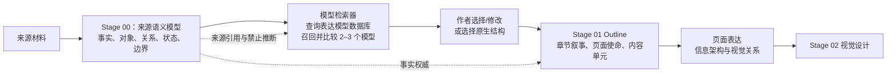

# 语义表达模型库设计

## 目标

让 CyberPPT 从来源语义出发，为全文、章节或页面匹配最贴近的表达模型；模型组织已确认的来源关系，不补造来源没有的事实、因果或结论。

## 总体思路

CyberPPT 的问题不是缺少更多模板，而是目前“来源理解、提纲组织、页面表达”之间没有一个可解释的模型选择层。结果是：来源段落可能被机械压缩，咨询模型可能被硬套，视觉类型又在下游重新猜测页面关系。

本方案在现有 Stage 00—Stage 01—Stage 02 之间增加一个轻量的**语义表达模型决策层**。它不是新的事实源，也不是自动生成 PPT 的第二条流程；它以一个可检索的“表达模型数据库”为基础，把当前语义理解中的已确认关系作为查询条件，检索相似的模型及其表达结构，再把作者确认的选择投影到既有 Outline 与页面表达字段。



### 分层职责

| 层 | 负责什么 | 不负责什么 |
| --- | --- | --- |
| 来源语义层 | 还原原文事实、论点、对象、关系、状态、边界与来源职责 | 选择 PPT 模板、补写战略结论 |
| 表达模型决策层 | 解释哪些模型贴近来源、各槽位由何处支撑、哪些槽位缺失 | 改写 Source Truth、强制选择模型 |
| Outline 作者层 | 结合交流目标选择/修改模型并组织章节与页面 | 用模型填补原文没有的内容 |
| 页面表达层 | 将已选模型转换为信息架构与视觉关系 | 重新判断来源论证、把视觉标签当作事实 |

### 核心原则

1. **先理解，再匹配。** 模型匹配只消费 Stage 00 的语义关系、Source Truth 和交流目标。
2. **候选而非裁决。** 系统展示推荐模型、替代模型、原生结构及理由；作者保有最终选择权。
3. **模型不等于内容。** 模型定义组织关系和必要槽位，不生成来源没有的事实。
4. **隐含关系可用但必须标识。** 例如 SCQA 的 Q 可由矛盾等强度归纳，但必须注明 `implicit` 与来源，不得伪装成原文直接表述。
5. **一模型一职责。** 每个实施方向仅保留一个代表模型；信息架构与视觉关系是模型的页面投影，不另行与框架竞争。

### 作者交互

在 Outline 人工门之前，系统针对全文、章节或关键页面展示：推荐模型、2 个替代候选、来源槽位映射、缺失槽位、禁止推断与预计的章节/页面影响。作者可选择推荐项、替换候选、编辑映射，或选 `source_native`。只有作者选择后的模型才进入 Outline；未选择时维持现有原生提纲流程。

### 表达模型库文件

首期只维护一个版本化的 Markdown 文件，例如 `references/semantic-expression-models.md`；不建数据库服务、不拆多张表。它不是提示词中的散装知识：每个模型使用固定小节和 YAML 元数据，既保存模型的语义适用条件，也保存其表达结构。

每条模型记录至少包括：

| 字段 | 作用 |
| --- | --- |
| `model_id` / `family` | 稳定标识及模型族，如 `scqa` / `narrative` |
| `applicability` | 适用的业务问题、来源关系、材料成熟度与交流目标 |
| `semantic_signature` | 可检索语义特征：对象类型、关系、状态、矛盾、行动、约束 |
| `slots` | 模型的必要/可选槽位，以及每个槽位允许的来源语义类型 |
| `expression_structure` | 章节或页面的阅读顺序、信息层级、可选信息架构表达 |
| `fit_rules` | 覆盖、冲突、缺失槽位和推断风险的评价规则 |
| `forbidden_inferences` | 模型使用时绝不允许补造的关系或结论 |
| `examples` | 仅作模型理解的抽象示例，不作为项目事实来源 |

语义理解的输出不是关键词列表，而是一个结构化检索请求：`业务对象 + 已证实关系 + 状态/成熟度 + 矛盾/目标 + 行动/约束 + 交流目标`。检索器读取该 MD 的 `semantic_signature` 召回候选，再校验其槽位能否由当前 Source Truth 覆盖；评分只用于排序，不自动填槽。模型的 `expression_structure` 决定如何组织章节、页面和信息架构，例如 SCQA 的 S—C—Q—A，而不是由下游视觉标签重新猜测。

同一模型条目内的 `expression_structure` 可列出多个可选结构，如 TOGAF ADM 的“架构域视图、差距分析、迁移路线”；它们是模型的表达方式，不另建第二张“表达结构表”。

### 自我迭代

模型库可随真实材料持续演进，但演进对象是模型条目，不是项目事实：

1. 语义理解检索后，如果没有候选模型达到可用覆盖度，或作者认为所有候选都扭曲了来源逻辑，系统提出“新模型/修订模型”建议。
2. 建议必须说明：它复用了哪些来源语义模式、与相近既有模型的差异、槽位定义、表达结构、禁止推断，以及至少一个匿名化回归案例。
3. 作者确认后，才将该条目写入同一份 `semantic-expression-models.md`，状态先为 `candidate`；已有模型的修改也必须保留变更说明。
4. 同一模型被两个以上独立材料成功选择、且来源槽位映射和 Outline 审计均通过后，状态可升为 `verified`。不满足时保留 `candidate`，不作为自动推荐的首选。
5. 任何条目若在新材料上持续出现槽位缺失、推断越界或作者拒绝，应降级、修订或标记 `deprecated`，但不删除其历史说明。

因此“自我迭代”是一个有证据、有版本记录、由作者确认的模型学习闭环；它不从单页文案、关键词命中或一次审计通过中自动总结新模型。

## 模型分类

| 模型族 | 用途 | 示例 |
| --- | --- | --- |
| 论证与叙事 | 组织判断、矛盾与回应 | SCQA、金字塔原理、MECE/问题树 |
| 管理咨询 | 分析经营、战略或组织问题 | 3C、价值链、7S、五力、SWOT |
| 信息架构 | 表达系统对象、层级、连接与运行 | 分层架构、能力地图、对象关系网络、数据流、闭环、生命周期、矩阵 |
| 推进与治理 | 表达责任、节奏、验证与控制 | 路线图、RACI、阶段门、风险控制 |

管理咨询模型不能默认适用于已有 Word。3C、五力、7S、SWOT 等需要来源已经包含相应分析，或用户明确授权补充外部研究；否则不得以模型槽位要求补写事实。

## 系统实施模型目录

系统实施不是单一模型，但模型库每个方向只保留一个最常用代表模型；只有来源语义同时涉及多个方向时才组合使用：

| 实施问题 | 候选模型 | 必须具备的来源语义 | 典型表达产物 |
| --- | --- | --- | --- |
| 从业务目标到目标架构、迁移与架构治理 | TOGAF ADM | 业务、数据/应用/技术架构或其差距，以及实施治理 | 架构愿景、基线/目标/差距、迁移路线、实施治理 |
| 交付范围、进度、干系人、风险和价值 | PMBOK（按情境裁剪） | 项目目标、交付物、责任、约束、节奏或风险 | 项目章程、工作分解、里程碑、风险与干系人治理 |
| 业务服务从需求到持续改进 | ITIL 4 服务价值系统 | 服务对象、需求、服务活动、合作方、运营与改进 | 服务价值链、服务目录、运营闭环、持续改进 |
| 信息技术治理与管理目标 | COBIT 2019 | 治理目标、组织结构、流程、信息、人员、政策或技术能力 | 治理目标—组件矩阵、责任与控制机制、度量体系 |
| 数据治理与数据服务运营 | DAMA-DMBOK | 数据对象、标准、质量、权责、生命周期、共享使用或服务 | 数据域、权责、标准质量、目录与服务运营模型 |
| 安全、可信使用和风险管理 | ISO/IEC 27001 ISMS | 风险、资产、控制、制度、审计或持续改进要求 | 风险—控制—证据链、管理体系、保障闭环 |
| 组织采用和协同变革 | Prosci ADKAR | 受影响角色、采用障碍、能力建设、沟通或激励机制 | 角色采用旅程、障碍—干预、变革保障 |
| 分阶段验证、试点到推广 | Stage-Gate | 阶段目标、试点范围、验收指标、决策门或反馈机制 | 阶段门、试点验证、迭代反馈、推广条件 |

这些模型中，TOGAF ADM、PMBOK、ITIL、COBIT、DAMA-DMBOK、ISO/IEC 27001、ADKAR 是完整方法或正式框架；RACI、路线图、能力地图、阶段门和闭环是可由框架调用的实施/信息架构表达模型，不与前者混称。

当前电力数据基础设施合作方案更可能匹配：SCQA（背景页）、DAMA-DMBOK（数据与服务运营）、COBIT（协同治理）、ITIL 4（服务运营）和 Stage-Gate（首期试点）；是否采用仍以原文是否给出相应要素为准。

## 数据合同

语义理解阶段在不改变 Source Truth 事实权威的前提下，为每个候选表达模型输出：

```json
{
  "scope": "document|chapter|page",
  "model_id": "scqa",
  "model_family": "narrative",
  "fit": "recommended|candidate|rejected|source_native",
  "fit_reason": "来源先交代背景，再呈现供需矛盾，并提出建设回应。",
  "source_mapping": [
    {"slot": "situation", "source_refs": ["ST0006"]},
    {"slot": "complication", "source_refs": ["ST0007", "ST0008"]},
    {"slot": "question", "source_refs": ["ST0007", "ST0008"], "derivation": "implicit", "statement": "如何形成稳定的跨主体行业服务供给？"},
    {"slot": "answer", "source_refs": ["ST0009"]}
  ],
  "missing_slots": [],
  "forbidden_inferences": ["不得把隐含问题表述为原文直接提问。"]
}
```

`source_mapping` 是表达层的可审计解释，不改写 Source Truth；`derivation=implicit` 必须标明来源和等强度说明。

## 匹配流程

1. 语义理解先产出来源事实、原子事项、关系、状态、边界与 `argument_duty`。
2. 匹配器从模型库召回 2–3 个候选，按来源关系覆盖、缺失槽位、引入推断风险和交流目标适配度评分。
3. 输出推荐模型、候选模型与拒绝理由；`source_native` 永远作为候选与兜底。
4. Outline 作者选择、修改或拒绝推荐模型。未经作者确认，候选模型不得强制改变章节、页数或上屏文案。
5. 选中的模型投影为章节叙事、页面语义关系及信息架构/视觉表达；视觉意图类型只作为页级空间呈现，不重新判断来源逻辑。

## P04 示例

P04 匹配 `SCQA`：ST0006 为 S；ST0007 与 ST0008 共同为 C；Q 为由供需矛盾等强度归纳的隐含问题；ST0009 为 A。页面可将 C 拆成需求侧与供给侧，但不应把四段原文机械等权平铺。

## 验证与失败处理

- 严格语义模型中，每个原子事项必须有来源论证职责；下游不得按关键词或页面类型猜测。
- 候选模型的每个已填槽位必须有 Source Truth 引用；隐含槽位必须声明 `derivation=implicit`。
- 若模型的关键槽位缺失，标为 `candidate` 或 `rejected`，不得补造内容；可选择 `source_native`。
- Outline 审计校验选中模型与页面/章节来源映射一致，但不以审计机械增加页面或模块。

## 非目标

- 不安装或直接依赖外部咨询插件。
- 不将模型库作为外部研究、市场数据或管理建议的替代品。
- 不以视觉模板、关键词或段落数量决定来源论证结构。
