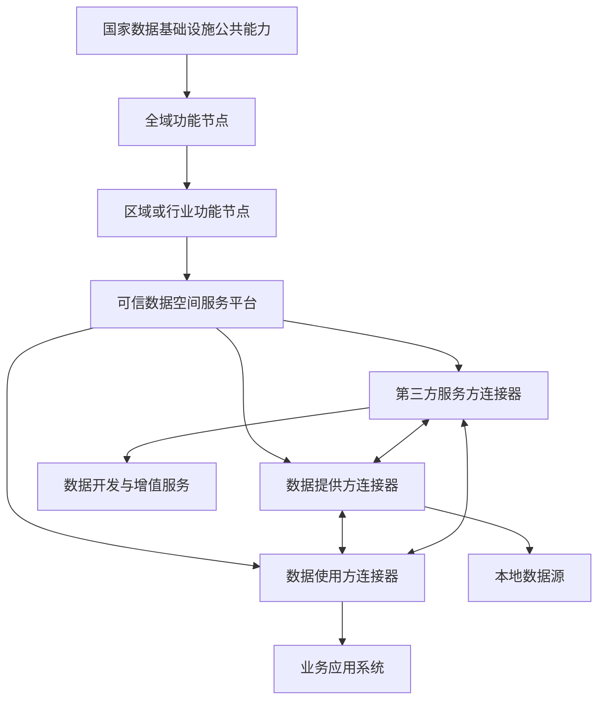
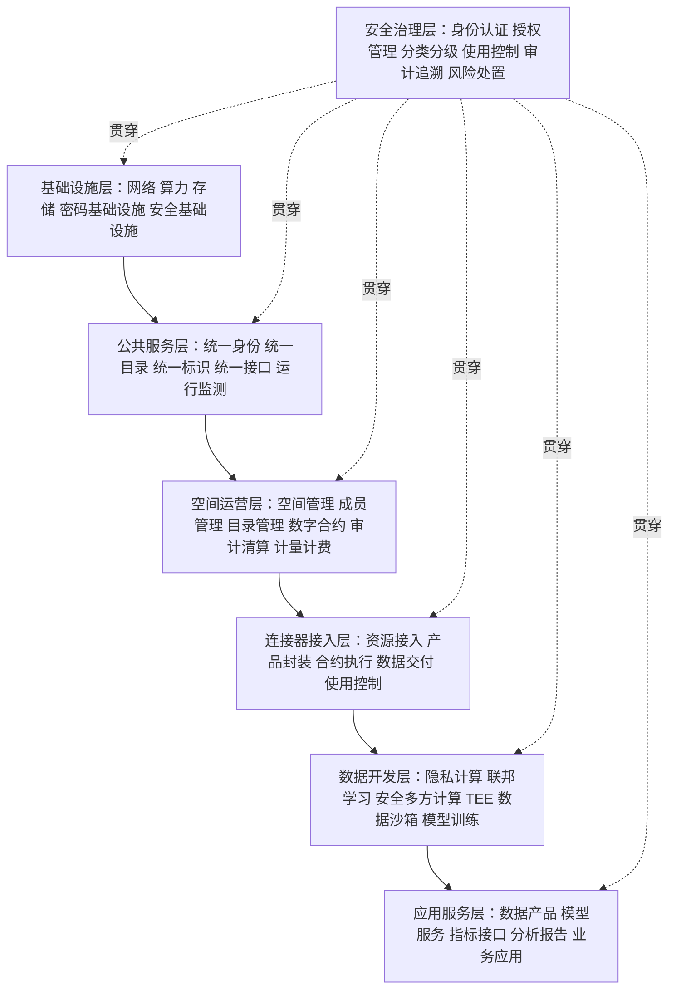
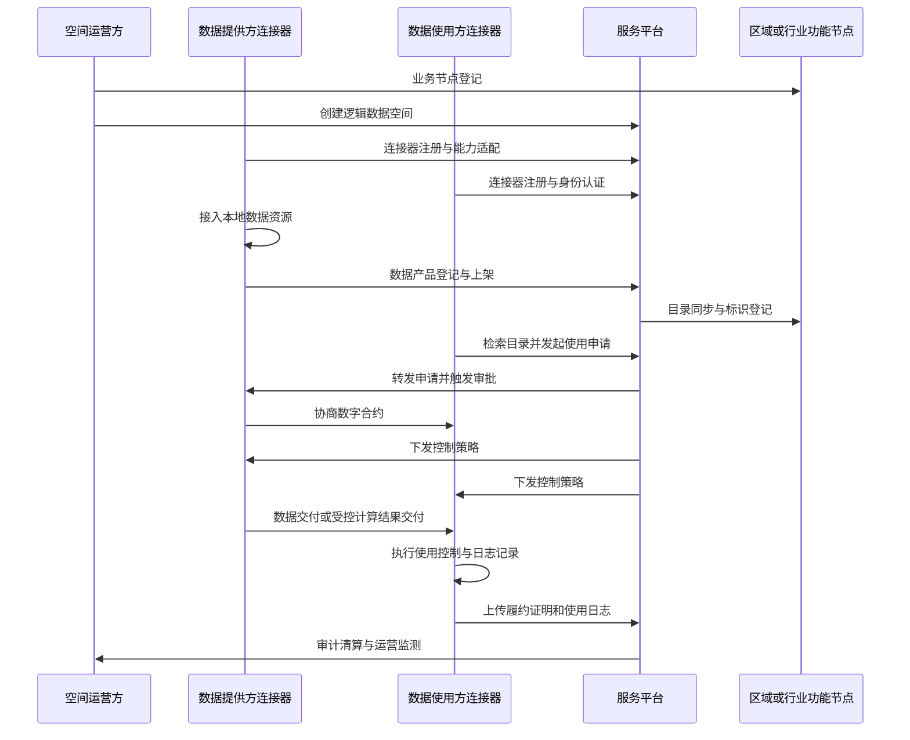
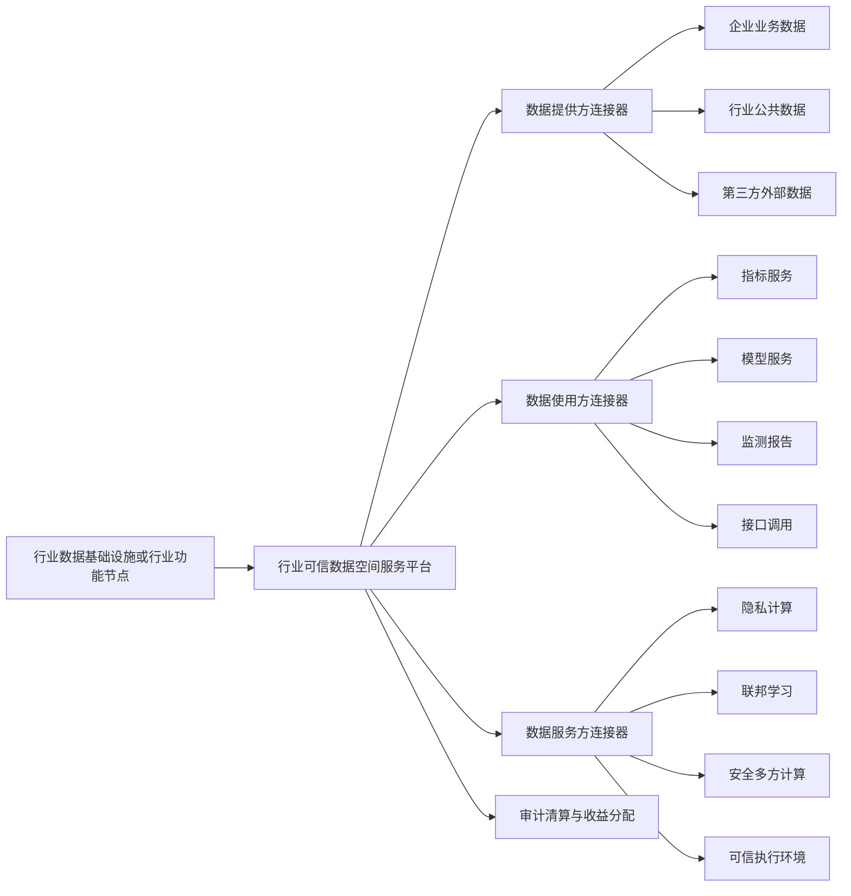

# 可信数据空间技术架构研究

生成日期：2026年6月28日

## 一、研究结论

可信数据空间的技术架构不宜理解为单一数据平台，也不宜简单等同于数据交易系统。较成熟的架构应体现"国家数据基础设施底座、可信数据空间服务平台、可信数据空间连接器、数据开发利用环境、合约与使用控制机制、安全审计与运营清算机制"的组合关系。

从现行政策、技术文件和国际数据空间实践看，可信数据空间技术架构具有六个基本判断：

1. 可信数据空间是数据流通利用基础设施的一种实现形态，应纳入国家数据基础设施总体架构之中。
2. 架构核心不是集中汇聚全部原始数据，而是通过目录、身份、标识、接口、连接器和控制策略，实现跨主体数据发现、授权、调用、交付和受控使用。
3. 技术组成上，可信数据空间主要由"服务平台"和"连接器"两类系统组成。服务平台承担空间运营、身份、目录、合约、审计、清算、开发环境等支撑功能；连接器承担主体接入、数据产品封装、合约执行、数据交付和使用控制等边缘侧功能。
4. 可信能力应落到"数字合约加使用控制"机制。数字合约表达谁可以使用、用什么、怎么用、用多久、用几次、能否转用、结果如何交付；使用控制机制保证合约约定在数据访问、传输、计算和使用过程中得到执行。
5. 数据安全能力应从边界防护转向全过程动态管控，重点包括身份认证、分类分级、授权管理、隐私计算、联邦学习、安全多方计算、可信执行环境、数据沙箱、日志存证、审计追溯和异常阻断。
6. 面向行业落地时，应坚持"场景牵引、资源目录化、数据产品化、计算受控化、服务运营化"，防止形成只建平台、不形成服务产品的技术堆叠。

## 二、政策与标准依据

| 序号 | 文件或资料 | 对技术架构的启示 |
|---|---|---|
| 1 | 《可信数据空间发展行动计划（2024—2028年）》 | 明确可信数据空间是数据流通利用基础设施，须具备可信管控、资源交互、价值共创三类核心能力；提出使用控制、数据沙箱、智能合约、隐私计算、高性能密态计算、可信执行环境等技术方向。 |
| 2 | 《可信数据空间技术架构》TC609—6—2025—01 | 明确可信数据空间由可信数据空间服务平台和可信数据空间连接器组成，并规定服务平台、连接器、接口和业务流程。 |
| 3 | 《国家数据基础设施建设指引》 | 提出国家数据基础设施具备数据采集、汇聚、传输、加工、流通、利用、运营、安全八大能力，并将可信数据空间列为数据流通利用设施的重要形态。 |
| 4 | 2025年可信数据空间创新发展试点通知 | 要求技术系统满足可信管控、资源交互、价值共创和安全管理等核心功能，并与应用场景、运营模式、规则制度相适配。 |
| 5 | International Data Spaces Reference Architecture Model | 强调数据主权、使用策略执行、可信生态和开放联邦式数据交换，对连接器、合同、策略和互操作设计具有参考价值。 |
| 6 | Eclipse Dataspace Components | 提供连接器、联邦目录、身份枢纽、注册服务、管理界面等开源参考组件，体现国际数据空间工程实现方向。 |

## 三、总体架构定位

可信数据空间应作为国家数据基础设施中的业务节点和应用生态载体来建设。其上接区域或行业功能节点，下接各参与方连接器，横向支持连接器之间的数据交互与合约执行，纵向接入统一身份、统一目录、统一标识和统一接口体系。

### 3.1 架构关系

### 3.2 架构边界

| 层级 | 主要职责 | 技术重点 |
|---|---|---|
| 国家数据基础设施公共能力 | 提供统一目录、统一身份、统一标识、统一接口等底座能力 | 全域身份、标识解析、目录互通、运行监测 |
| 区域或行业功能节点 | 承接区域、行业维度的身份、目录、接口、业务节点登记与协同 | 行业规则、区域协同、跨空间互认 |
| 可信数据空间服务平台 | 支撑空间运营、成员管理、目录管理、数字合约、审计清算、数据开发、托管服务 | 空间管理、合约管理、资源发布、计量清算、开发环境 |
| 可信数据空间连接器 | 作为各参与方加入空间的入口，连接本地数据、应用和服务 | 数据产品封装、合约执行、数据交付、使用控制、日志上报 |
| 数据与应用侧系统 | 承载原始数据、业务系统、模型服务、行业应用 | 数据治理、接口适配、模型调用、业务闭环 |

## 四、逻辑分层架构

可信数据空间可按照"基础设施层、公共服务层、空间运营层、连接器接入层、数据开发层、应用服务层、安全治理层"进行设计。

## 五、核心系统组成

## 5.1 可信数据空间服务平台

可信数据空间服务平台是运营方管理空间、组织多方协作和支撑数据流通利用的核心系统。其功能可分为必备功能、增强功能和场景扩展功能。

| 功能模块 | 主要职责 | 建设要点 |
|---|---|---|
| 身份管理 | 支持主体注册、身份认证、身份更新、空间身份注销 | 与区域或行业功能节点对接，实现身份互认和可信接入 |
| 连接器管理 | 支持连接器注册、认证、运行监测、能力适配 | 连接器应具备身份、能力、策略执行和日志上报能力 |
| 数据空间管理 | 支持创建、删除、配置修改、成员管理、运行监测 | 同一物理平台可承载多个逻辑数据空间 |
| 目录管理 | 支持数据产品登记、产品上架、目录检索、使用申请、服务目录 | 目录应包含分类分级、场景、数据类型、使用策略等元数据 |
| 数字合约管理 | 支持策略模板、合约创建、协商、签署、备案、解除 | 策略模板应覆盖使用者、用途、次数、期限、范围、销毁等条件 |
| 存证审计 | 记录合约、数据发布、申请、使用、交付、运行等日志 | 可结合区块链、时间戳、数字签名、哈希校验等方式增强可信性 |
| 审计清算 | 支持使用计量、费用核算、权益分配、争议核验 | 应与数字合约、使用日志、订单和结算规则打通 |
| 数据交易 | 支持数据市场、需求中心、交易订单、计量计费 | 属于可选增强功能，应服务于场景运营和商业闭环 |
| 数据开发 | 支持数据集成、标注、加工、开发工具集成 | 可引入隐私计算、数据沙箱、可信执行环境、智能体开发框架等工具 |
| 数据托管 | 支持托管环境、产品授权、代理交付、代理记录 | 适合中小主体或数据运营能力不足的主体 |
| 国际空间互通网关 | 支持与IDS、Gaia-X、Catena-X等国际数据空间互通 | 适用于跨境数据空间或国际协作场景 |
| 第三方服务接入 | 接入算力、质量评估、合规审查、数据治理、存储等服务 | 应通过连接器或标准接口实现可控接入 |

## 5.2 可信数据空间连接器

连接器是各类参与方进入可信数据空间的入口，也是实现合约执行、数据交付和使用控制的关键载体。连接器不只是接口网关，还应具备策略执行、日志存证和本地资源管理能力。

| 功能模块 | 主要职责 | 建设要点 |
|---|---|---|
| 数据资源管理 | 接入本地数据库、对象存储、文件服务器、业务系统 | 支持资源目录、资源配置、资源删除和变更管理 |
| 身份管理 | 管理连接器用户、连接器身份、密钥、能力信息 | 支持主体身份核验和权限授予 |
| 数据产品管理 | 将接入数据资源封装为数据产品并配置使用策略 | 数据产品可采用数据集、文件、API、模型接口、计算结果等形态 |
| 数字合约管理 | 支持合约创建、协商、签订、履行 | 合约应与数据产品、使用策略、交付方式和审计记录绑定 |
| 数据交付 | 按合约要求完成原始数据、脱敏数据或计算结果交付 | 可采用加密、脱敏、隐私计算、数据沙箱等方式进行交付前处理 |
| 数据使用控制 | 在本地或受控环境中执行数据使用策略 | 支持实时监测、异常终止、细粒度日志、履约证明上传 |
| 运行监测 | 采集连接器运行状态和业务日志 | 向服务平台和区域或行业功能节点上报必要信息 |

## 六、核心能力架构

## 6.1 可信管控能力

可信管控能力解决"数据提供方为什么敢供、数据使用方为什么能用、监管方如何可审计"的问题。

| 能力项 | 技术实现 | 场景价值 |
|---|---|---|
| 主体可信 | 统一身份、实名核验、多因素认证、连接器认证 | 确认谁进入空间、谁调用数据、谁执行服务 |
| 数据可信 | 数据目录、数据标识、元数据、质量校验、来源记录 | 确认数据来源、版本、质量、适用边界 |
| 授权可信 | 授权规则、合约策略模板、用途控制、期限控制 | 控制数据能否被访问、被谁访问、用于什么目的 |
| 使用可信 | 使用控制、策略执行、数据沙箱、隐私计算、TEE | 保证数据访问、计算、分析行为符合合约约定 |
| 过程可信 | 日志存证、哈希校验、时间戳、数字签名、区块链存证 | 支持过程追溯、合规检查和纠纷处理 |
| 结果可信 | 输出审核、模型说明、结果水印、版本留痕 | 降低模型服务、指标服务和报告服务的责任不清风险 |
| 权益可信 | 计量计费、订单管理、收益分配、清算审计 | 支撑多方共创后的持续运营和利益分配 |

## 6.2 资源交互能力

资源交互能力解决"数据和服务如何被发现、理解、申请、调用、互认"的问题。

| 能力项 | 技术实现 | 场景价值 |
|---|---|---|
| 目录发布 | 数据产品目录、服务目录、业务节点目录 | 实现数据资源和服务资源可见、可查、可申请 |
| 标识解析 | 唯一标识、标识解析、连接器地址管理 | 支持跨平台、跨空间、跨主体定位资源 |
| 语义互通 | 元数据标准、语义模型、行业本体、字段映射 | 降低异构数据融合和跨主体理解成本 |
| 接口互通 | 标准API、连接器接口、服务平台接口 | 支持跨空间查询、申请、合约、交付和监管 |
| 跨空间互认 | 身份互认、规则互认、目录互通、合约策略映射 | 支持不同数据空间之间的服务复用和资源共享 |

## 6.3 价值共创能力

价值共创能力解决"数据如何从资源变成产品和服务"的问题。

| 能力项 | 技术实现 | 场景价值 |
|---|---|---|
| 数据开发环境 | 数据集成、标注、加工、低代码工具、任务调度 | 支撑数据产品开发和持续迭代 |
| 安全计算环境 | 隐私计算、联邦学习、安全多方计算、TEE、密态计算 | 支持原始数据不外流前提下的联合分析和模型训练 |
| 模型服务能力 | 模型训练、模型调用、模型评估、模型版本管理 | 支撑预测、诊断、评价、推荐等高阶应用 |
| 第三方服务接入 | 数据治理、合规审查、数据经纪、审计清算、算力服务 | 构建开放生态，降低单一运营方能力不足风险 |
| 产品运营能力 | 订阅、API调用、年度服务、按次计费、收益分配 | 形成可持续商业闭环 |

## 七、关键接口架构

可信数据空间接口可按南北向接口和东西向接口组织。

| 接口类型 | 连接对象 | 主要内容 |
|---|---|---|
| 南北向接口一 | 区域或行业功能节点与可信数据空间服务平台 | 身份注册、身份验证、目录上报、标识解析、业务节点登记、运行监测 |
| 南北向接口二 | 区域或行业功能节点与可信数据空间连接器 | 身份核验、连接器注册、目录查询、标识解析、运行监测 |
| 南北向接口三 | 可信数据空间服务平台与连接器 | 身份接口、数据产品接口、数字合约接口、使用控制接口、合规监管接口、连接器管理接口 |
| 东西向接口 | 连接器与连接器 | 身份认证、数字合约协商、数据目录查询、数据交付、使用控制、履约证明 |

## 八、数据流转业务流程

可信数据空间的技术架构应围绕完整业务流程设计，避免只建设静态目录或单点数据接口。

## 九、数据交付与计算模式

可信数据空间不要求所有场景采用同一种数据交付模式。应根据数据敏感性、业务实时性、合规要求、产品形态选择不同技术路径。

| 模式 | 适用场景 | 技术要点 | 风险控制 |
|---|---|---|---|
| API调用模式 | 指标查询、模型调用、实时服务 | API网关、身份认证、调用限流、日志存证 | 控制字段范围、调用频次、调用主体和返回结果 |
| 文件或数据集交付模式 | 低敏数据集、已授权数据包、批量分析 | 加密传输、脱敏处理、数字水印、交付存证 | 严格分类分级和合约约束，防止二次扩散 |
| 数据不出域模式 | 企业敏感经营数据、行业核心数据 | 本地连接器、受控计算、结果输出 | 原始数据保留在提供方环境，仅输出指标、报告或模型参数 |
| 隐私计算模式 | 多方联合统计、联合建模、交叉验证 | 安全多方计算、联邦学习、同态加密、密态计算 | 明确参与方、算法、结果颗粒度和安全边界 |
| 数据沙箱模式 | 第三方分析、科研计算、模型验证 | 隔离环境、权限控制、结果审核、行为审计 | 限制外发、复制、截屏、下载和外部网络访问 |
| 可信执行环境模式 | 高敏数据计算、云上受控运行 | TEE远程证明、代码度量、密钥管理、运行日志 | 保证代码和环境可信，输出结果需审核 |
| 托管运营模式 | 中小企业或弱技术能力主体 | 数据托管、代理授权、代理交付、代理日志 | 明确托管边界、运营责任和数据提供方审计权 |

## 十、关键技术组件清单

| 技术组件 | 所处层级 | 核心作用 |
|---|---|---|
| 统一身份管理 | 公共服务层、服务平台、连接器 | 支持主体、平台、连接器、用户身份可信接入 |
| 数据目录 | 公共服务层、服务平台、连接器 | 支持数据产品和服务的发布、查询、发现和申请 |
| 数据标识 | 公共服务层 | 支持数据产品唯一定位、版本管理和全生命周期追溯 |
| 连接器 | 连接器接入层 | 连接本地数据、应用和空间服务，执行合约与使用控制 |
| 数字合约 | 空间运营层、连接器接入层 | 固化供需双方关于数据内容、用途、范围、期限、计费和责任的约定 |
| 使用控制引擎 | 连接器接入层、安全治理层 | 实时监测和控制数据访问、处理、转发和销毁行为 |
| 隐私计算平台 | 数据开发层 | 支持数据可用不可见、联合分析和联合建模 |
| 联邦学习平台 | 数据开发层 | 支持多方数据不汇聚条件下的模型训练 |
| 安全多方计算 | 数据开发层 | 支持多方输入保密条件下的联合计算 |
| 可信执行环境 | 数据开发层、安全治理层 | 提供可远程证明的可信计算环境 |
| 数据沙箱 | 数据开发层、安全治理层 | 提供隔离、受控、可审计的数据分析环境 |
| 存证审计系统 | 空间运营层、安全治理层 | 支持合约、申请、交付、使用、结果输出的全过程留痕 |
| 计量计费系统 | 空间运营层 | 支持调用计量、订单管理、费用核算和收益分配 |
| 数据开发工具链 | 数据开发层 | 支持数据清洗、标注、加工、建模、低代码开发和智能体开发 |
| 模型服务平台 | 应用服务层 | 支持模型发布、模型调用、模型监测和版本管理 |

## 十一、部署形态

## 11.1 集中目录、分布式数据源

该形态适用于数据敏感性较高、参与主体较多的行业场景。服务平台集中管理目录、身份、合约、审计和清算，数据保留在各主体本地，通过连接器受控访问或计算。

优势：符合数据不出域要求，降低原始数据集中化风险。

约束：对连接器能力、接口标准、跨主体治理要求较高。

## 11.2 中央托管、统一运营

该形态适用于低敏数据、公共数据产品、中小主体服务能力不足的场景。数据提供方授权服务平台或托管方进行统一存储、加工、发布和运营。

优势：建设和运营效率高，适合形成标准化数据产品。

约束：需严格明确托管边界、数据权属、授权范围和托管方责任。

## 11.3 混合式部署

该形态适用于多数行业可信数据空间。低敏数据和可公开数据可托管运营，高敏数据和企业核心数据保留在本地，通过隐私计算、数据沙箱或TEE进行受控开发利用。

优势：兼顾效率、安全和业务可落地性。

约束：需要较强的数据分类分级、授权管理和策略编排能力。

## 11.4 跨空间互联部署

该形态适用于跨区域、跨行业、跨境或集团型场景。不同可信数据空间通过统一身份、目录、标识、接口和规则映射实现互联互通。

优势：扩大数据产品和服务复用范围，形成网络化数据生态。

约束：跨空间规则互认、责任划分、收益分配和监管协同难度较高。

## 十二、面向行业场景的推荐技术架构

行业可信数据空间应以行业组织、龙头企业或公共服务平台作为运营牵引主体，围绕高价值场景构建行业数据库、知识库、模型库和服务产品体系。

行业场景建议采用以下建设口径：

| 建设环节 | 推荐做法 |
|---|---|
| 场景选择 | 优先选择数据协同价值高、单一主体数据不足、客户付费意愿明确、可形成标准产品的场景 |
| 数据接入 | 先目录化、再产品化，区分原始数据、加工数据、指标数据、模型服务和报告成果 |
| 安全边界 | 对企业敏感数据和行业核心数据，优先采用数据不出域、受控计算、结果输出模式 |
| 技术配置 | 按场景配置隐私计算、联邦学习、安全多方计算、TEE、数据沙箱等能力，不做无差别堆叠 |
| 运营闭环 | 建立数据上架、授权申请、合约签署、服务调用、计量计费、审计清算、收益分配机制 |
| 产品形态 | 优先形成年度服务、监测报告、模型接口、指标接口、专题分析、行业数据库等可交付产品 |

## 十三、技术架构建设路线

## 13.1 第一阶段：场景与资源梳理

1. 明确场景的业务对象、决策链条、使用主体和付费主体。
2. 梳理数据资源清单，标注数据来源、敏感等级、更新频率、授权状态和可用方式。
3. 确定数据产品形态，包括数据集、指标、模型、接口、报告和应用服务。
4. 制定数据分类分级、授权使用、审计追溯和输出审核规则。

## 13.2 第二阶段：最小可用架构建设

1. 建设服务平台基础能力，包括身份管理、空间管理、目录管理、数字合约、审计存证。
2. 部署数据提供方、数据使用方和第三方服务方连接器。
3. 完成数据产品登记、目录上架、使用申请、合约签署、控制策略下发、日志上报的闭环。
4. 选择一个高价值场景形成样板服务。

## 13.3 第三阶段：安全计算与数据开发能力增强

1. 引入隐私计算、联邦学习、安全多方计算、TEE、数据沙箱等安全开发环境。
2. 构建行业知识库、模型库和指标库。
3. 建立模型训练、模型调用、模型评估、结果审核和版本管理机制。
4. 将数据资源转化为可持续交付的数据产品和模型服务。

## 13.4 第四阶段：运营清算与跨空间互联

1. 建立计量计费、订单管理、收益分配和争议处置机制。
2. 接入数据治理、数据经纪、数据托管、合规审查、审计清算等第三方服务。
3. 与区域或行业功能节点实现身份、目录、标识、接口和运行监测互联。
4. 探索跨空间身份互认、目录互通、规则互认和服务复用。

## 十四、建设风险与控制措施

| 风险 | 表现 | 控制措施 |
|---|---|---|
| 平台化空转 | 建设大量平台模块，但缺少明确业务场景和客户服务 | 以场景牵引架构，先形成最小可用服务闭环 |
| 原始数据外流风险 | 将可信数据空间误解为原始数据集中交易平台 | 建立分类分级和数据不出域机制，优先采用受控计算和结果输出 |
| 合约与技术脱节 | 线下协议存在，但连接器不执行策略 | 将数字合约、使用控制、日志存证和履约证明打通 |
| 目录不可用 | 目录只列名称，缺少质量、口径、更新频率、使用策略 | 建立元数据规范、数据质量规则和目录审核机制 |
| 接口烟囱化 | 各主体各建接口，难以跨空间互通 | 按统一身份、目录、标识、接口要求建设连接器和服务平台 |
| 安全技术堆叠 | 隐私计算、TEE、区块链等技术堆砌，未与场景绑定 | 按数据敏感性、计算需求、交付形态选择技术组合 |
| 收益分配不清 | 数据方、服务方、运营方贡献难计量 | 建立调用计量、成本核算、收益分配和审计清算规则 |
| 监管审计不足 | 出现争议后无法追溯数据来源、路径和使用行为 | 全流程日志存证，覆盖发布、申请、授权、交付、计算、输出和结算 |

## 十五、架构成熟度评估表

| 维度 | 初始级 | 成长级 | 成熟级 |
|---|---|---|---|
| 场景牵引 | 有场景设想 | 有明确客户和数据产品 | 形成可复制业务闭环 |
| 资源管理 | 有数据清单 | 有目录和元数据 | 有质量、版本、标识和授权管理 |
| 主体接入 | 人工准入 | 连接器接入和身份认证 | 跨空间身份互认和能力适配 |
| 合约管理 | 线下协议为主 | 数字合约支持策略模板 | 合约与使用控制、计量、审计联动 |
| 使用控制 | 静态权限控制 | 连接器执行部分策略 | 全流程动态控制和异常阻断 |
| 安全计算 | 简单脱敏 | 隐私计算或数据沙箱试点 | 多种安全计算环境按场景组合应用 |
| 审计追溯 | 系统日志分散 | 关键流程存证 | 全流程可查验、可追责、可清算 |
| 产品运营 | 项目制交付 | 数据产品或接口服务 | 年度服务、订阅、API、模型服务等多模式运营 |
| 生态协同 | 少数参与方 | 数据方、使用方、服务方接入 | 数据治理、合规、审计、经纪、托管等生态服务完善 |

## 十六、参考资料

[1] 国家数据局：《可信数据空间发展行动计划（2024—2028年）》。https://www.nda.gov.cn/sjj/xxgk/gknr/ghjh/1125/ff808081-92b8a4f1-0193-612f2a6d-04c4.pdf

[2] 全国数据标准化技术委员会：《可信数据空间技术架构》TC609—6—2025—01。https://www.nda.gov.cn/form-files-sjj/2c99e457-8f9edeed-018f-b8a7537c-0243/2c99e457-8f9edeed-018f-b8ad7daf-0256/fileupload_scfj/2025/04/19/ff808081-95c633c9-0196-4c64126d-1a4f.pdf

[3] 国家发展改革委等：《国家数据基础设施建设指引》。https://www.ndrc.gov.cn/xxgk/zcfb/tz/202501/P020250106319424108511.pdf

[4] 国家数据局综合司：《关于组织开展2025年可信数据空间创新发展试点工作的通知》。https://www.nda.gov.cn/sjj/zwgk/zcfb/0415/20250407172325097704036_pc.html

[5] International Data Spaces Association：IDS Reference Architecture Model。https://internationaldataspaces.org/offers/reference-architecture/

[6] Eclipse Foundation：Eclipse Dataspace Components。https://projects.eclipse.org/projects/technology.edc

[7] Eclipse Dataspace Protocol。https://eclipse-dataspace-protocol-base.github.io/DataspaceProtocol/
